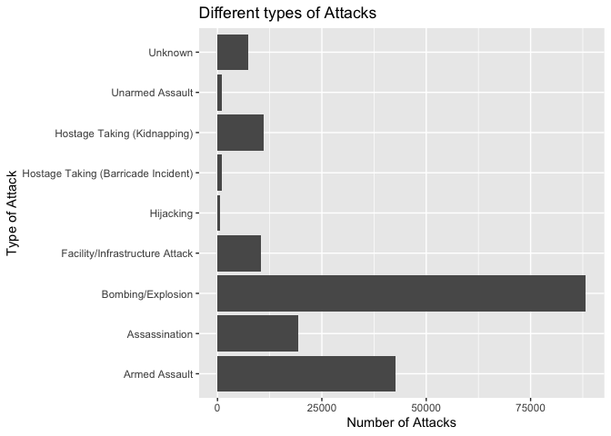
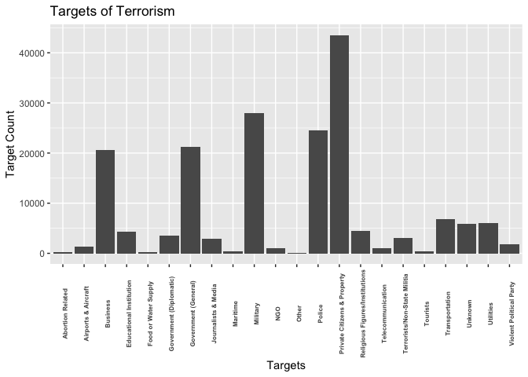
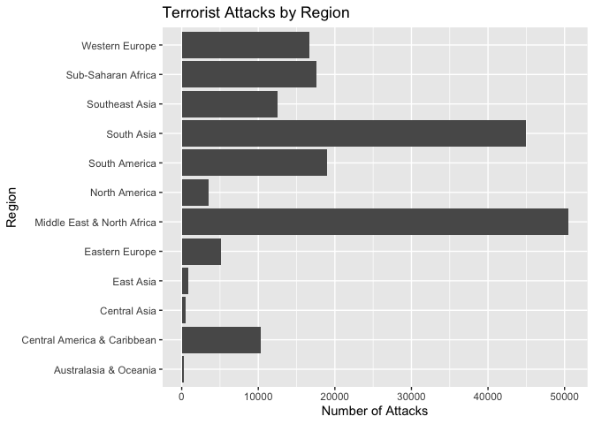
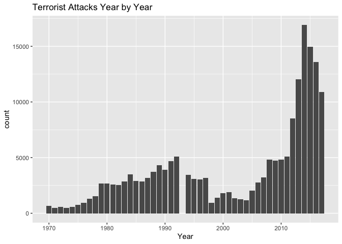
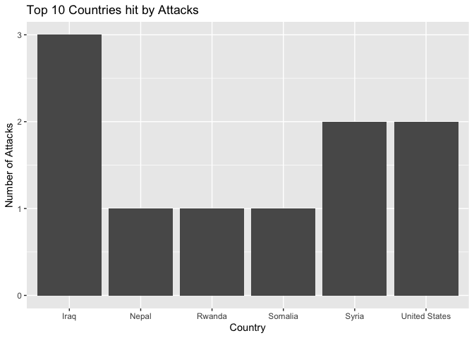
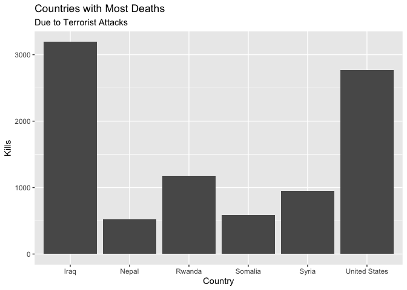
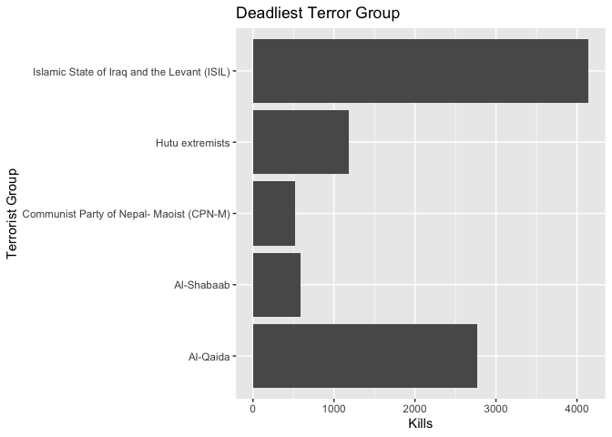
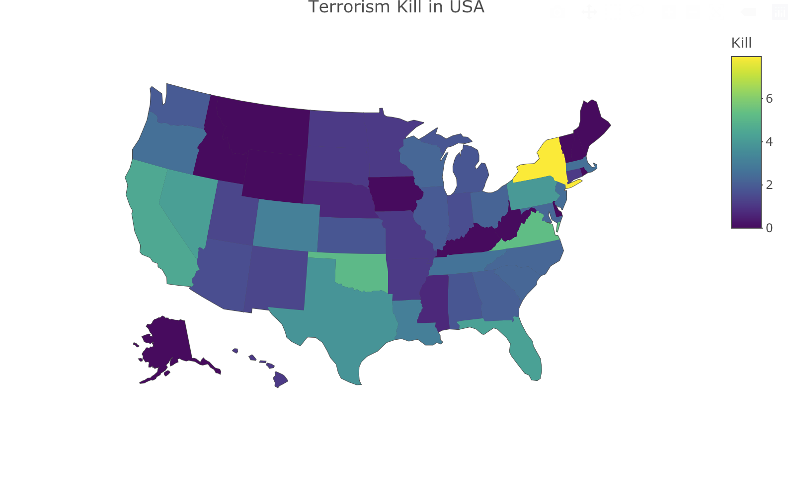

```{r setup, include=FALSE}
knitr::opts_chunk$set(echo = TRUE)
library(tidyverse)
library(ggplot2)
library(plotly)
library(dplyr)
```

## Introduction

The talk and threat of terrorism has grown substantially over the last 20 years. It is not just here in America that we face these fears, but it is across the globe. The following analysis looks at the types of threats and violence that every day people has faced sinced the 1970s.

#### Data Set

The data set used in this analysis comes from the [Global Terrorism Database](https://www.kaggle.com/START-UMD/gtd), which is an open-source database that includes information on terrorist attacks starting in 1970 and going all the way through 2017.

#### Questions to be addressed

For this analysis I will be looking at the amount of terrorist attacks there were throughout the years. Finding particular regions that were hit the hardest and the type of weapons that were used more predominantly in these attacks.

## Methods

Utilize Explortary Data Analysis to clean the data, extract main variables from the dataset and visualize the key information.

## Analyze

#### Load Data

```{r}
terrorism <- read.csv("globalterrorismdb_0718dist.csv")
```

#### Explore Data

```{r,include=FALSE}
head(terrorism)
dim(terrorism)
str(terrorism)
```

```{r include=FALSE}
nrow(terrorism)
ncol(terrorism)
```


There are 135 variables(quite a lot) and 181691 observations

#### check na values

```{r include=FALSE}
terrorism %>%
  is.na() %>%
  sum()
```


There is huge amount of data lost, and we only need particular important variables, so we can reconstruct the data frame with key variables left only.

#### Create new dataframe
```{r include=FALSE}
terrorism <- terrorism %>% 
  rename('Year'='iyear', 'Month'='imonth', 'Day'='iday', 'Group'='gname', 'Country'='country_txt', 'Region'='region_txt', 'State'='provstate', 'City'='city', 'Attacktype'='attacktype1_txt', 'Targettype'='targtype1_txt', 'Weapon'='weaptype1_txt', 'Kill'='nkill', 'Wound'='nwound')

terrorism <- terrorism %>%
  select(Year, Month, Day, Group, Country, Region, State, City, Attacktype, Targettype, Weapon, Kill, Wound)
```

#### EDA of new dataframe
```{r include=FALSE}
is_null(terrorism)
n_distinct(terrorism)
```

```{r include=FALSE}
ncol(terrorism)
nrow(terrorism)
terrna <- terrorism %>%
  is.na() %>%
  sum()
```

About `r terrna / 181691 / 13 * 100` % data was missing, which is tolerable

#### Statistics summary
```{r}
terrorism %>%
  summary()
```

## Data Visualization

```{r include=FALSE}
ggplot(terrorism) + 
  geom_bar(mapping = aes(y=Attacktype)) + 
  labs(title="Different types of Attacks", y="Type of Attack", x="Number of Attacks")
```


The above graph shows that the most common used attack by terrorist groups was bombing/explosion.

```{r include=FALSE}
ggplot(terrorism) + 
  geom_bar(mapping = aes(x=Targettype)) + 
  theme(axis.text.x = element_text(face="bold", size=6, angle=90)) + 
  labs(title="Targets of Terrorism", x="Targets", y="Target Count")
```


Private citizens and property were the most targeted group of people around the globe.

```{r include=FALSE}
ggplot(terrorism) + 
  geom_bar(mapping = aes(y=Region)) + 
  labs(title = "Terrorist Attacks by Region", x="Number of Attacks")
```


The middle East and North Africa had the most attacks occur in their region over the timeline of this data collection.
```{r include=FALSE}
ggplot(terrorism) + 
  geom_bar(mapping = aes(x=Year)) + 
  labs(title = "Terrorist Attacks Year by Year") 
```


It was interesting to see the climb in terrorist attacks in just the last 10 years.

```{r include=FALSE}
pd = position_dodge(0.3)
ggplot(terrorism, aes(Year, Kill))+
  geom_point(size=3, position=pd)
```


Along with the climb in attacks, unfortunately came with the increase in deaths over the last 10 years.

#### Digging deeper into analysis
```{r include=FALSE}
terrorism_trim_country <- terrorism %>%
  arrange(desc(Kill)) %>%
  head(10)
```

```{r include=FALSE}
ggplot(terrorism_trim_country) + 
  geom_bar(mapping = aes(x=Country)) + 
  labs(title = "Top 10 Countries hit by Attacks", y="Number of Attacks")
```


If we look closer at where these attacks are taking place. We can see that Iraq, Syria, and the United States take claim for where these are taking place.

```{r include=FALSE}
ggplot(terrorism_trim_country) + 
  geom_col(mapping = aes(x=Country, y=Kill)) + 
  labs(title = "Countries with Most Deaths", subtitle = "Due to Terrorist Attacks", y="Kills")
ggplot(terrorism_trim_country) + 
  geom_col(mapping= aes(x=Kill, y=Group)) + 
  labs(title="Deadliest Terror Group", y="Terrorist Group", x="Kills")  
```



The terrorist group that has been responsible for the most deaths around the globe is ISIL. Al-Qaida is the group with the second most.

```{r include=FALSE}
state_data <- read_csv("state.csv")
usa <- left_join(terrorism[terrorism$Country=="United States",], state_data, by=c("State"="state_name"))
usa$Kill[is.na(usa$Kill)] = 0
usa_kill <-
  usa %>% 
  group_by(state) %>% 
  summarise(Kill = log(sum(Kill) + 1))
p3 <- plot_geo(usa_kill) %>%
  add_trace(
    z = ~Kill, span=I(0),
    locations = ~state, locationmode="USA-states")  %>%
  layout(geo=list(
                  scope = 'usa',
                  projection = list(type = 'albers usa'),
                  lakecolor = toRGB('white')
                 ),
         title='Terrorism Kill in USA'
        )
```





## Conclusion

Based on the preliminary results above, we could reach the following conclusion:

In the last 10 years, there is a climb in terrorist attacks and killings. Most used attack type is bombing/explosion and private citizens and property is the most targeted group.

Iraq is suffering from the terrorism most and ISIL is responsible for the the most deaths around the globe.
