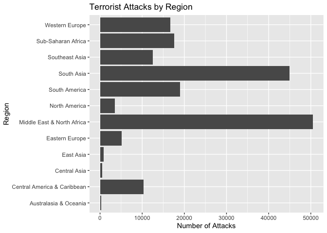
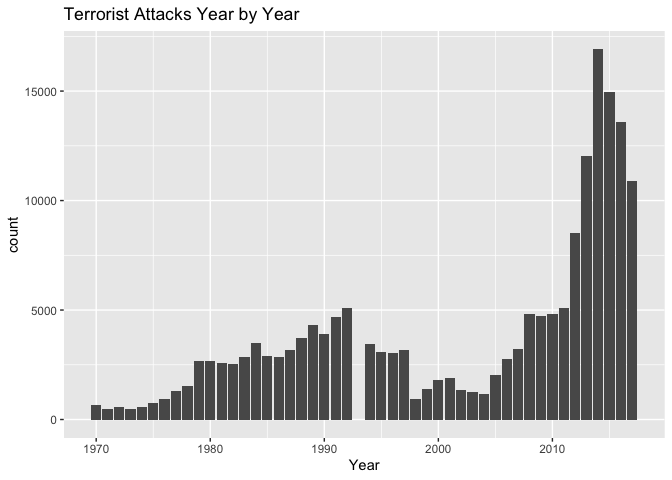
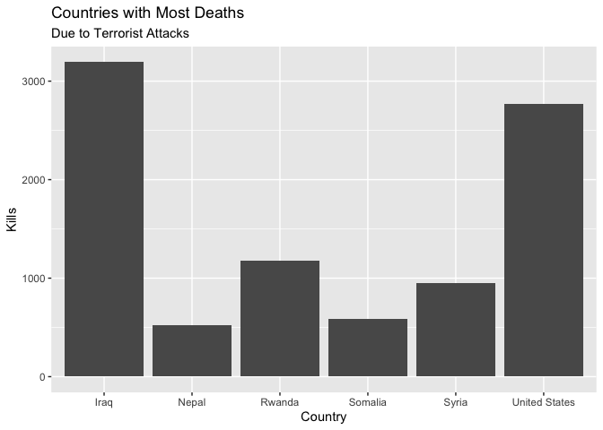
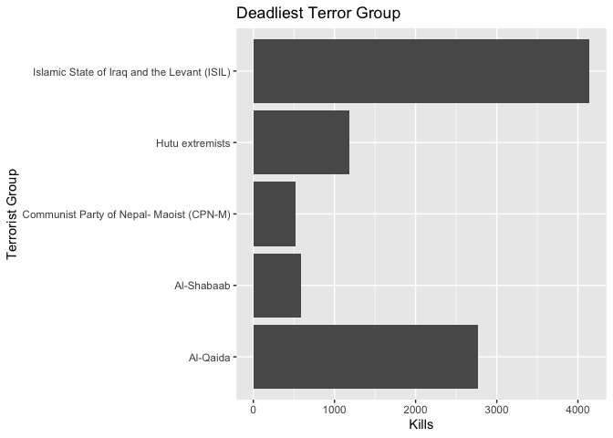
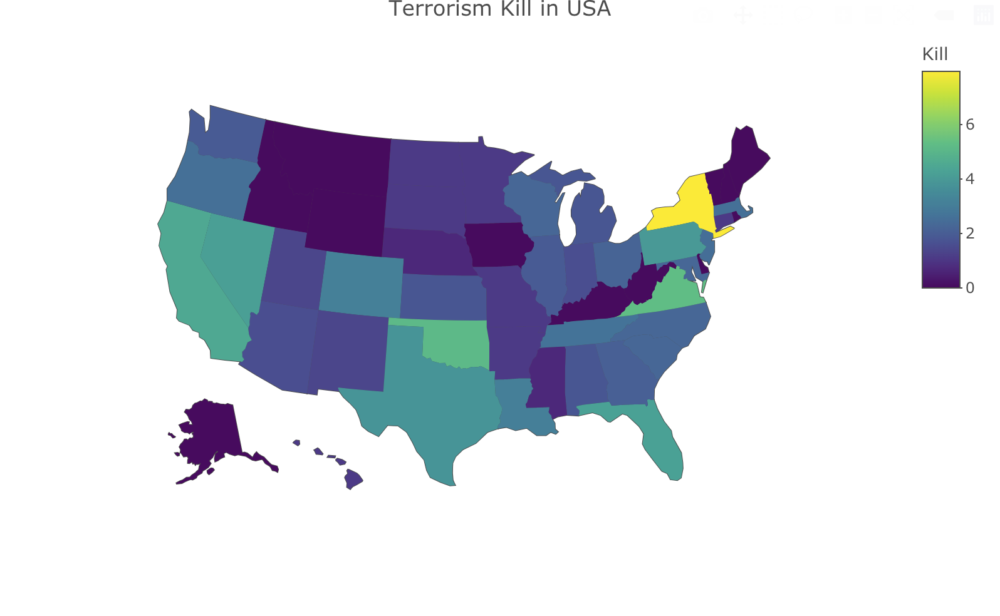

Midterm-Global Terrorism
================
Mingxi Xu
10/20/2021

## Introduction

The talk and threat of terrorism has grown substantially over the last
20 years. It is not just here in America that we face these fears, but
it is across the globe. The following analysis looks at the types of
threats and violence that every day people has faced sinced the 1970s.

#### Data Set

The data set used in this analysis comes from the [Global Terrorism
Database](https://www.kaggle.com/START-UMD/gtd), which is an open-source
database that includes information on terrorist attacks starting in 1970
and going all the way through 2017.

#### Questions to be addressed

For this analysis I will be looking at the amount of terrorist attacks
there were throughout the years. Finding particular regions that were
hit the hardest and the type of weapons that were used more
predominantly in these attacks.

## Methods

Utilize Explortary Data Analysis to clean the data, extract main
variables from the dataset and visualize the key information.

## Analyze

#### Load Data

``` r
terrorism <- read.csv("globalterrorismdb_0718dist.csv")
```

#### Explore Data

There are 135 variables(quite a lot) and 181691 observations

#### check na values

There is huge amount of data lost, and we only need particular important
variables, so we can reconstruct the data frame with key variables left
only.

#### Create new dataframe

#### EDA of new dataframe

About 1.1271885 % data was missing, which is tolerable

#### Statistics summary

``` r
terrorism %>%
  summary()
```

    ##       Year          Month             Day           Group          
    ##  Min.   :1970   Min.   : 0.000   Min.   : 0.00   Length:181691     
    ##  1st Qu.:1991   1st Qu.: 4.000   1st Qu.: 8.00   Class :character  
    ##  Median :2009   Median : 6.000   Median :15.00   Mode  :character  
    ##  Mean   :2003   Mean   : 6.467   Mean   :15.51                     
    ##  3rd Qu.:2014   3rd Qu.: 9.000   3rd Qu.:23.00                     
    ##  Max.   :2017   Max.   :12.000   Max.   :31.00                     
    ##                                                                    
    ##    Country             Region             State               City          
    ##  Length:181691      Length:181691      Length:181691      Length:181691     
    ##  Class :character   Class :character   Class :character   Class :character  
    ##  Mode  :character   Mode  :character   Mode  :character   Mode  :character  
    ##                                                                             
    ##                                                                             
    ##                                                                             
    ##                                                                             
    ##   Attacktype         Targettype           Weapon               Kill         
    ##  Length:181691      Length:181691      Length:181691      Min.   :   0.000  
    ##  Class :character   Class :character   Class :character   1st Qu.:   0.000  
    ##  Mode  :character   Mode  :character   Mode  :character   Median :   0.000  
    ##                                                           Mean   :   2.403  
    ##                                                           3rd Qu.:   2.000  
    ##                                                           Max.   :1570.000  
    ##                                                           NA's   :10313     
    ##      Wound         
    ##  Min.   :   0.000  
    ##  1st Qu.:   0.000  
    ##  Median :   0.000  
    ##  Mean   :   3.168  
    ##  3rd Qu.:   2.000  
    ##  Max.   :8191.000  
    ##  NA's   :16311

## Data Visualization


The above graph shows that the most common used attack by terrorist
groups was bombing/explosion.


Private citizens and property were the most targeted group of people
around the globe.



The middle East and North Africa had the most attacks occur in their
region over the timeline of this data collection.



It was interesting to see the climb in terrorist attacks in just the
last 10 years.


Along with the climb in attacks, unfortunately came with the increase in
deaths over the last 10 years.

#### Digging deeper into analysis


If we look closer at where these attacks are taking place. We can see
that Iraq, Syria, and the United States take claim for where these are
taking place.




The terrorist group that has been responsible for the most deaths around
the globe is ISIL. Al-Qaida is the group with the second most.



## Conclusion

Based on the preliminary results above, we could reach the following
conclusion:

In the last 10 years, there is a climb in terrorist attacks and
killings. Most used attack type is bombing/explosion and private
citizens and property is the most targeted group.

Iraq is suffering from the terrorism most and ISIL is responsible for
the the most deaths around the globe.
