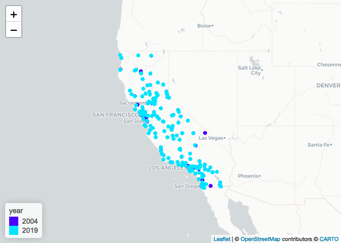
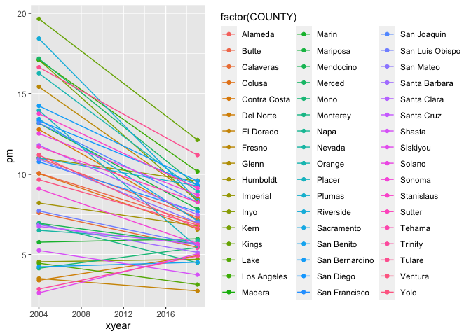
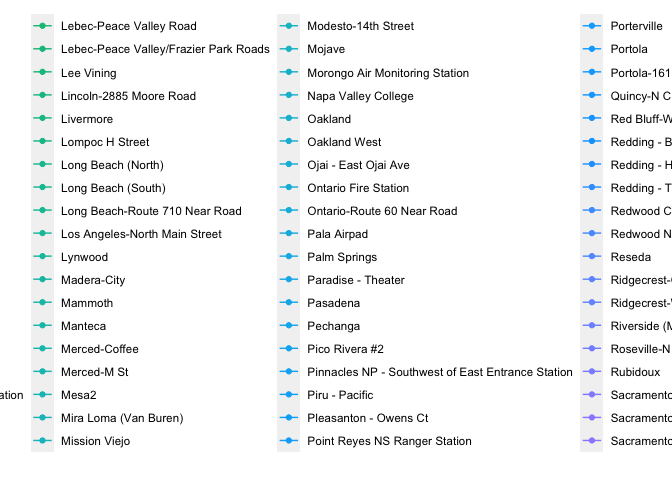

```{r setup, include=FALSE}
knitr::opts_chunk$set(echo = TRUE)
```

### 1. Given the formulated question from the assignment description, you will now conduct EDA Checklist items 2-4. First, download 2004 and 2019 data for all sites in California from the EPA Air Quality Data website. Read in the data using data.table(). For each of the two datasets, check the dimensions, headers, footers, variable names and variable types. Check for any data issues, particularly in the key variable we are analyzing. Make sure you write up a summary of all of your findings.

#### create two variables

```{r}
library(tidyverse)
library(data.table)
data_2014 <- data.table::fread("2014.csv")
data_2019 <- data.table::fread("2019.csv")
```

#### check the dimensions, headers, footers, variable names and variable types.

```{r}
dim(data_2014)
head(data_2014)
tail(data_2014)
str(data_2014)
dim(data_2019)
head(data_2019)
tail(data_2019)
str(data_2019)
```

#### check some key variables
```{r}
summary(data_2014$`Daily Mean PM2.5 Concentration`)
summary(data_2014$DAILY_AQI_VALUE)
summary(data_2019$`Daily Mean PM2.5 Concentration`)
summary(data_2019$DAILY_AQI_VALUE)
```

it looks like Daily.Mean.PM2.5.Concentration’s data has some problems, we need to remove the data that less than 0

```{r}
# data_2014[data_2014$`Daily Mean PM2.5 Concentration` < 0, "Daily Mean PM2.5 Concentration"] <- NA
# summary(data_2014$`Daily Mean PM2.5 Concentration`)
# data_2019[data_2019$`Daily Mean PM2.5 Concentration` < 0, "Daily Mean PM2.5 Concentration"] <- NA
# summary(data_2019$`Daily Mean PM2.5 Concentration`)
```


### 2. Combine the two years of data into one data frame. Use the Date variable to create a new column for year, which will serve as an identifier. Change the names of the key variables so that they are easier to refer to in your code.

```{r}
total <- rbind(data_2014, data_2019)
total$year <- format(as.POSIXct(total$Date, format = "%m/%d/%Y"), format = "%Y")
# format(total$Date, format = "%Y")
colnames(total)[which(names(total) == "Daily Mean PM2.5 Concentration" )] <- "mean_2.5"
colnames(total)[which(names(total) == "DAILY_AQI_VALUE" )] <- "aqi"
colnames(total)[which(names(total) == "SITE_LATITUDE" )] <- "lat"
colnames(total)[which(names(total) == "SITE_LONGITUDE" )] <- "lon"
colnames(total)[which(names(total) == "Site Name" )] <- "site_name"
```

### 3. Create a basic map in leaflet() that shows the locations of the sites (make sure to use different colors for each year). Summarize the spatial distribution of the monitoring sites.

```{r}
library(leaflet)

temp.pal <- colorFactor(topo.colors(2), domain = total$year)
m <- leaflet(total) %>%
  addCircles(
    lat = ~lat, lng = ~lon,
    label = ~year, color = ~temp.pal(year),
    opacity = 1, fillOpacity = .5,radius = 500
  ) %>%
  addLegend('bottomleft', pal = temp.pal, values = total$year,
            title = 'year', opacity = 1)
m %>%
  addProviderTiles(providers$CartoDB.Positron)
```


### 4. Check for any missing or implausible values of PM2.5 in the combined dataset. Explore the proportions of each and provide a summary of any temporal patterns you see in these observations.

```{r}
total %>%
  summarize(negative = mean(mean_2.5 < 0, na.rm = T))
```

### 5. Explore the main question of interest at three different spatial levels. Create exploratory plots (e.g. boxplots, histograms, line plots) and summary statistics that best suit each level of data. Be sure to write up explanations of what you observe in these data.  state county  site in Los Angeles

```{r}
state <- group_by(total, year, STATE) %>%
  summarize(pm = mean(mean_2.5, na.rm = T))
```

```{r}
qplot(xyear, pm, data = mutate(state, xyear = as.numeric(as.character(year))),
      color = factor(STATE),
      geom = c("point", "line"))
```

```{r}
county <- group_by(total, year, COUNTY) %>%
  summarize(pm = mean(mean_2.5, na.rm = T))
qplot(xyear, pm, data = mutate(county, xyear = as.numeric(as.character(year))),
      color = factor(COUNTY),
      geom = c("point", "line"))
```

```{r}
site <- group_by(total, year, site_name) %>%
  summarize(pm = mean(mean_2.5, na.rm = T))
qplot(xyear, pm, data = mutate(site, xyear = as.numeric(as.character(year))),
      color = factor(site_name),
      geom = c("point", "line"))
```


