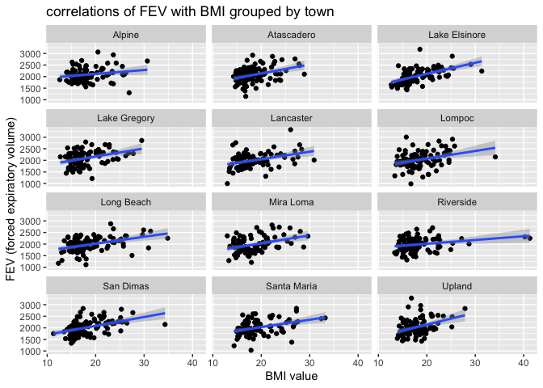
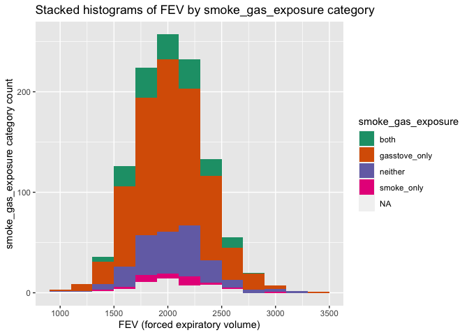
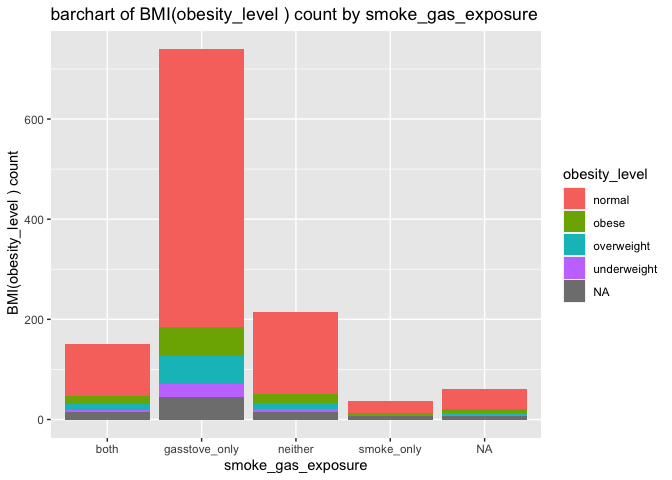
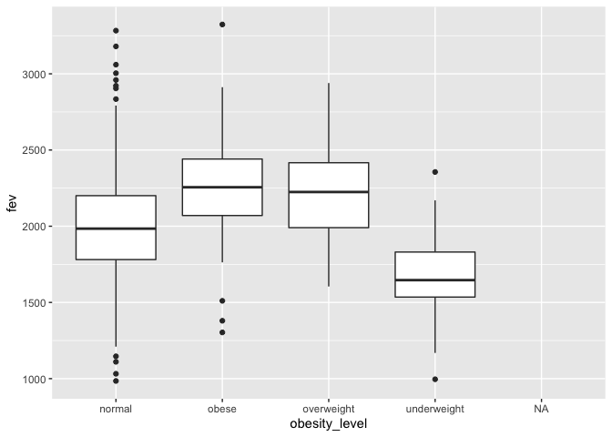
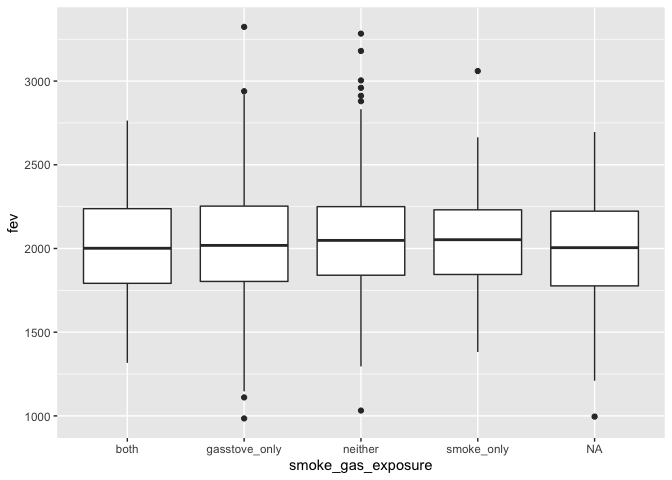
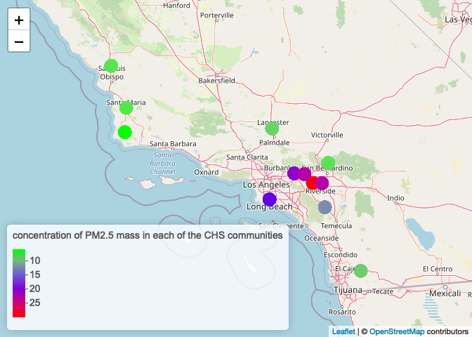
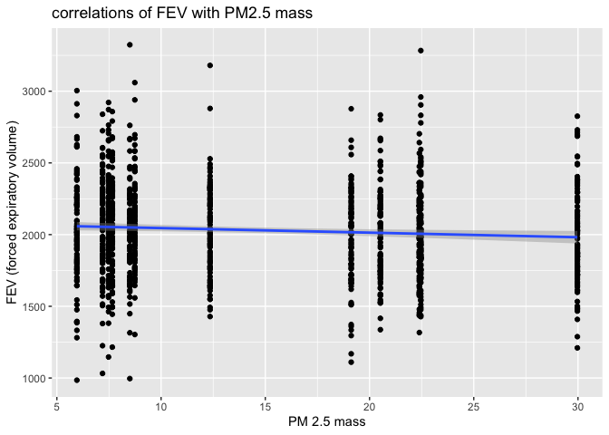
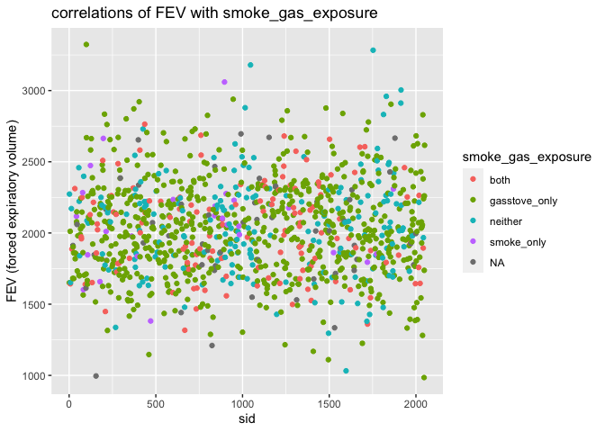

## Data Wrangling
You will need to download two datasets from https://github.com/USCbiostats/data-science-data. The individual and regional CHS datasets in 01_chs. The individual data includes personal and health characteristics of children in 12 communities across Southern California. The regional data include air quality measurements at the community level. Once downloaded, you can merge these datasets using the location variable. Once combined, you will need to do the following:

**1. After merging the data, make sure you don’t have any duplicates by counting the number of rows. Make sure it matches.**

```{r}
library(data.table)
library(dtplyr)
library(dplyr)
ind <- data.table::fread("chs_individual.csv")
reg <- data.table::fread("chs_regional.csv")

dat<-merge(x= ind, y=reg, by.x  = "townname", by.y  = "townname",
                all.x = TRUE, all.y = FALSE)

nrow(distinct(dat))==nrow(dat) # check duplicates
nrow(dat)==nrow(ind) # make sure it matches

```

There are no duplicated rows and it matches.

**2. Create a new categorical variable named “obesity_level” using the BMI measurement (underweight BMI<14; normal BMI 14-22; overweight BMI 22-24; obese BMI>24). To make sure the variable is rightly coded, create a summary table that contains the minimum BMI, maximum BMI, and the total number of observations per category.**

```{r warning=FALSE}

dat$obesity_level[dat$bmi<14] <-"underweight"
dat$obesity_level[dat$bmi>=14 & dat$bmi<22]<-"normal"
dat$obesity_level[dat$bmi>=22 & dat$bmi<24] <- "overweight"
dat$obesity_level[dat$bmi>=24]<-"obese"
summary <- dat[,.(
  minimum = min(bmi, na.rm=TRUE),
  maximum = max(bmi, na.rm=TRUE),
  total = length(bmi)), by=obesity_level]
summary
sum(summary$total)==1200
```

The "obesity_level" variable is rightly coded, the total number of observations per category matches 1200. There is also an "NA" category because of the NA values of "bmi" variable


**3. Create another categorical variable named “smoke_gas_exposure” that summarizes “Second Hand Smoke” and “Gas Stove.” The variable should have four categories in total.**

```{r}
dat$smoke_gas_exposure[dat$smoke==0 & dat$gasstove ==0] = "neither"
dat$smoke_gas_exposure[dat$smoke==1 & dat$gasstove ==0] = "smoke_only"
dat$smoke_gas_exposure[dat$smoke==0 & dat$gasstove ==1] = "gasstove_only"
dat$smoke_gas_exposure[dat$smoke==1 & dat$gasstove ==1] = "both"
dat[,.(total = length(smoke)), by=smoke_gas_exposure]

```

There four categories for the "smoke_gas_exposure" variable, except for some "NA" variables coming from "smoke" or "gasstove"


**4. Create four summary tables showing the average (or proportion, if binary) and sd of “Forced expiratory volume in 1 second (ml)” and asthma indicator by town, sex, obesity level, and “smoke_gas_exposure.”**

```{r}
#by town
dat[,.(
   fev_average_town = mean(fev, na.rm=TRUE),
   fev_sd_town= sd(fev, na.rm=TRUE),
   asthma_mean_town = mean(asthma, na.rm = TRUE),
   asthma_sd_town = sd(asthma, na.rm = TRUE)
), by = townname]
#by sex
dat[,.(
   fev_average_sex = mean(fev,na.rm=TRUE),
   fev_sd_sex= sd(fev,na.rm=TRUE),
   asthma_mean_sex = mean(asthma,na.rm=TRUE),
   asthma_sd_sex = sd(asthma, na.rm = TRUE)
), by = male]

#by obesity level
dat[,.(
   fev_average_obesity = mean(fev,na.rm=TRUE),
   fev_sd_obesity = sd(fev,na.rm=TRUE),
   asthma_mean_obesity = prop.table(asthma),
   asthma_sd_obesity = sd(asthma, na.rm = TRUE)
), by = obesity_level]


#by smoke_gas_exposure.
dat[,.(
   fev_average_sgp = mean(fev,na.rm=TRUE),
   fev_sd_sgp= sd(fev,na.rm=TRUE),
   asthma_mean_sgp = mean(asthma, na.rm = TRUE),
   asthma_sd_sgp = sd(asthma, na.rm = TRUE)
), by = smoke_gas_exposure]

```


## Looking at the Data (EDA)
The primary questions of interest are: 1. What is the association between BMI and FEV (forced expiratory volume)? 2. What is the association between smoke and gas exposure and FEV? 3. What is the association between PM2.5 exposure and FEV?

Follow the EDA checklist from week 3 and the previous assignment. Be sure to focus on the key variables. Visualization Create the following figures and interpret them. Be sure to include easily understandable axes, titles, and legends.

**1. Facet plot showing scatterplots with regression lines of BMI vs FEV by “townname”.**


```{r}
library(ggplot2)
dat %>%
  ggplot(aes(x= bmi, y=fev))+geom_point()+
  facet_wrap(~townname, nrow=4)+
  stat_smooth(method = lm,na.rm=TRUE)+
  labs(title = "correlations of FEV with BMI grouped by town",y="FEV (forced expiratory volume)",x="BMI value")
```

FEV is positively correlated with BMI. In addition, the magnitude may be a little different across different towns( might not be significant)


**2. Stacked histograms of FEV by BMI category and FEV by smoke/gas exposure. Use different color schemes than the ggplot default.**
```{r}
dat %>%
  ggplot(aes(x = fev, fill=obesity_level))+
  geom_histogram(binwidth=200)+
  scale_fill_brewer(palette = "Dark2")+
  labs(title = "Stacked histograms of FEV by BMI category", x="FEV (forced expiratory volume)",y="BMI category(obesity_level) count")
```


```{r}
dat %>%
  ggplot(aes(x = fev, fill=smoke_gas_exposure))+
  geom_histogram(binwidth=200)+
  scale_fill_brewer(palette = "Dark2")+
  labs(title = "Stacked histograms of FEV by smoke_gas_exposure category", x="FEV (forced expiratory volume)",y="smoke_gas_exposure category count")
```


**3. Barchart of BMI by smoke/gas exposure.**


```{r}
dat %>% ggplot(aes(x= smoke_gas_exposure, fill=obesity_level))+
              geom_bar()+
   labs(title = "barchart of BMI(obesity_level ) count by smoke_gas_exposure  ", x="smoke_gas_exposure",y=" BMI(obesity_level ) count")
```


**4. Statistical summary graphs of FEV by BMI and FEV by smoke/gas exposure category.**

```{r}
dat %>%
  ggplot(aes(x=obesity_level, y=fev))+geom_boxplot()
  labs(title = " Statistical summary graphs of FEV by BMI",x="BMI(obesity_level)", y="FEV (forced expiratory volume)" )
  
dat %>%
  ggplot(mapping=aes(x=smoke_gas_exposure, y=fev))+geom_boxplot()
  labs(title = " Statistical summary graphs of FEV by smoke/gas exposure",x="smoke_gas_exposure",y="FEV (forced expiratory volume)")
```


**5. A leaflet map showing the concentrations of PM2.5 mass in each of the CHS communities.**

```{r}
library(leaflet)

pm25_pal = colorNumeric(c('green','blue','red'), domain=dat$pm25_mass)
leaflet(dat)%>%
  addProviderTiles("OpenStreetMap")%>%
  addCircles(lat=~lat,lng=~lon,color=~pm25_pal(pm25_mass),opacity=1,fillOpacity=1, radius=7000)%>%
addLegend("bottomleft", pal=pm25_pal,values =dat$pm25_mass, title="concentration of PM2.5 mass in each of the CHS communities", opacity=1)
```


**6. Choose a visualization to examine whether PM2.5 mass is associated with FEV.**

```{r}
library(ggplot2)
dat %>%
  ggplot(aes(x= pm25_mass, y=fev))+geom_point()+
  stat_smooth(method = lm,na.rm=TRUE)+
  labs(title = "correlations of FEV with PM2.5 mass",y="FEV (forced expiratory volume)",x="PM 2.5 mass")
```

The scatterplot tells us FEV (forced expiratory volume) is not correlated with PM 2.5 mass in each of the CHS communities


## The primary questions of interest

1. What is the association between BMI and FEV (forced expiratory volume)?

FEV is positively correlated with BMI. In addition, the magnitude may be a little different across different towns( might not be significant)

2. What is the association between smoke and gas exposure and FEV?
```{r}
library(ggplot2)
dat %>%
  ggplot(aes(x=sid,y=fev,color=smoke_gas_exposure))+geom_point()+
  labs(title = "correlations of FEV with smoke_gas_exposure",y="FEV (forced expiratory volume)",x="sid")
```

From the boxplot of "Statistical summary graphs of FEV by smoke/gas exposure"  and this additional scatterplot, smoke and gas exposure may not be associated with FEV.

3. What is the association between PM2.5 exposure and FEV? 

The FEV (forced expiratory volume) is not correlated with PM 2.5 mass in each of the CHS communities


