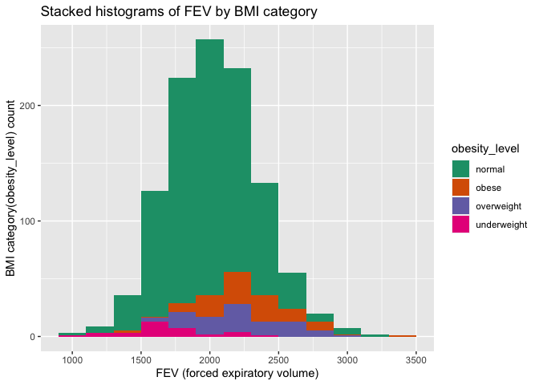
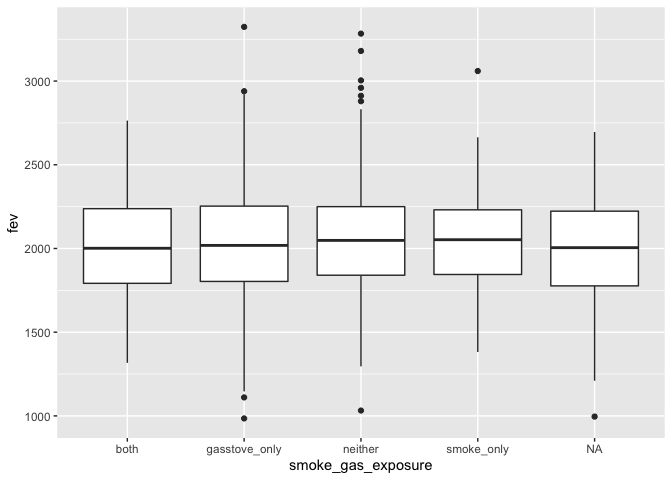
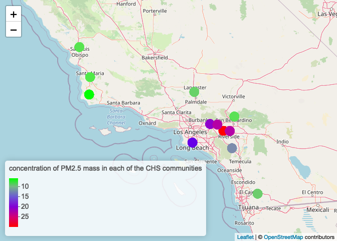

HW2
================
Mingxi Xu
10/3/2021

## Data Wrangling

You will need to download two datasets from
<https://github.com/USCbiostats/data-science-data>. The individual and
regional CHS datasets in 01\_chs. The individual data includes personal
and health characteristics of children in 12 communities across Southern
California. The regional data include air quality measurements at the
community level. Once downloaded, you can merge these datasets using the
location variable. Once combined, you will need to do the following:

**1. After merging the data, make sure you don’t have any duplicates by
counting the number of rows. Make sure it matches.**

``` r
library(data.table)
library(dtplyr)
library(dplyr)
```

    ## 
    ## 载入程辑包：'dplyr'

    ## The following objects are masked from 'package:data.table':
    ## 
    ##     between, first, last

    ## The following objects are masked from 'package:stats':
    ## 
    ##     filter, lag

    ## The following objects are masked from 'package:base':
    ## 
    ##     intersect, setdiff, setequal, union

``` r
ind <- data.table::fread("chs_individual.csv")
reg <- data.table::fread("chs_regional.csv")

dat<-merge(x= ind, y=reg, by.x  = "townname", by.y  = "townname",
                all.x = TRUE, all.y = FALSE)

nrow(distinct(dat))==nrow(dat) # check duplicates
```

    ## [1] NA

``` r
nrow(dat)==nrow(ind) # make sure it matches
```

    ## [1] TRUE

There are no duplicated rows and it matches.

**2. Create a new categorical variable named “obesity\_level” using the
BMI measurement (underweight BMI&lt;14; normal BMI 14-22; overweight BMI
22-24; obese BMI&gt;24). To make sure the variable is rightly coded,
create a summary table that contains the minimum BMI, maximum BMI, and
the total number of observations per category.**

``` r
dat$obesity_level[dat$bmi<14] <-"underweight"
dat$obesity_level[dat$bmi>=14 & dat$bmi<22]<-"normal"
dat$obesity_level[dat$bmi>=22 & dat$bmi<24] <- "overweight"
dat$obesity_level[dat$bmi>=24]<-"obese"
summary <- dat[,.(
  minimum = min(bmi, na.rm=TRUE),
  maximum = max(bmi, na.rm=TRUE),
  total = length(bmi)), by=obesity_level]
summary
```

    ##    obesity_level  minimum  maximum total
    ## 1:        normal 14.00380 21.96387   886
    ## 2:    overweight 22.02353 23.99650    87
    ## 3:         obese 24.00647 41.26613   103
    ## 4:          <NA>      Inf     -Inf    89
    ## 5:   underweight 11.29640 13.98601    35

``` r
sum(summary$total)==1200
```

    ## [1] TRUE

The “obesity\_level” variable is rightly coded, the total number of
observations per category matches 1200. There is also an “NA” category
because of the NA values of “bmi” variable

**3. Create another categorical variable named “smoke\_gas\_exposure”
that summarizes “Second Hand Smoke” and “Gas Stove.” The variable should
have four categories in total.**

``` r
dat$smoke_gas_exposure[dat$smoke==0 & dat$gasstove ==0] = "neither"
dat$smoke_gas_exposure[dat$smoke==1 & dat$gasstove ==0] = "smoke_only"
dat$smoke_gas_exposure[dat$smoke==0 & dat$gasstove ==1] = "gasstove_only"
dat$smoke_gas_exposure[dat$smoke==1 & dat$gasstove ==1] = "both"
dat[,.(total = length(smoke)), by=smoke_gas_exposure]
```

    ##    smoke_gas_exposure total
    ## 1:            neither   214
    ## 2:               <NA>    60
    ## 3:         smoke_only    36
    ## 4:      gasstove_only   739
    ## 5:               both   151

There four categories for the “smoke\_gas\_exposure” variable, except
for some “NA” variables coming from “smoke” or “gasstove”

**4. Create four summary tables showing the average (or proportion, if
binary) and sd of “Forced expiratory volume in 1 second (ml)” and asthma
indicator by town, sex, obesity level, and “smoke\_gas\_exposure.”**

``` r
#by town
dat[,.(
   fev_average_town = mean(fev, na.rm=TRUE),
   fev_sd_town= sd(fev, na.rm=TRUE),
   asthma_mean_town = mean(asthma, na.rm = TRUE),
   asthma_sd_town = sd(asthma, na.rm = TRUE)
), by = townname]
```

    ##          townname fev_average_town fev_sd_town asthma_mean_town asthma_sd_town
    ##  1:        Alpine         2089.014    298.2039        0.1134021      0.3187308
    ##  2:    Atascadero         2079.374    331.8782        0.2551020      0.4381598
    ##  3: Lake Elsinore         2039.787    317.6112        0.1263158      0.3339673
    ##  4:  Lake Gregory         2091.665    337.8286        0.1515152      0.3603750
    ##  5:     Lancaster         2002.550    337.1053        0.1649485      0.3730620
    ##  6:        Lompoc         2038.227    367.4474        0.1134021      0.3187308
    ##  7:    Long Beach         1983.896    330.6271        0.1354167      0.3439642
    ##  8:     Mira Loma         1984.726    336.6416        0.1578947      0.3665767
    ##  9:     Riverside         1986.212    289.7415        0.1100000      0.3144660
    ## 10:     San Dimas         2027.806    321.9740        0.1717172      0.3790537
    ## 11:   Santa Maria         2022.553    330.0457        0.1340206      0.3424442
    ## 12:        Upland         2027.284    357.2010        0.1212121      0.3280346

``` r
#by sex
dat[,.(
   fev_average_sex = mean(fev,na.rm=TRUE),
   fev_sd_sex= sd(fev,na.rm=TRUE),
   asthma_mean_sex = mean(asthma,na.rm=TRUE),
   asthma_sd_sex = sd(asthma, na.rm = TRUE)
), by = male]
```

    ##    male fev_average_sex fev_sd_sex asthma_mean_sex asthma_sd_sex
    ## 1:    0        1959.105   327.2948       0.1208054     0.3261747
    ## 2:    1        2103.819   318.2036       0.1727749     0.3783828

``` r
#by obesity level
dat[,.(
   fev_average_obesity = mean(fev,na.rm=TRUE),
   fev_sd_obesity = sd(fev,na.rm=TRUE),
   asthma_mean_obesity = prop.table(asthma),
   asthma_sd_obesity = sd(asthma, na.rm = TRUE)
), by = obesity_level]
```

    ##       obesity_level fev_average_obesity fev_sd_obesity asthma_mean_obesity
    ##    1:        normal            1997.974       309.4085                  NA
    ##    2:        normal            1997.974       309.4085                  NA
    ##    3:        normal            1997.974       309.4085                  NA
    ##    4:        normal            1997.974       309.4085                  NA
    ##    5:        normal            1997.974       309.4085                  NA
    ##   ---                                                                     
    ## 1196:   underweight            1686.800       300.0803           0.0000000
    ## 1197:   underweight            1686.800       300.0803           0.0000000
    ## 1198:   underweight            1686.800       300.0803           0.3333333
    ## 1199:   underweight            1686.800       300.0803           0.0000000
    ## 1200:   underweight            1686.800       300.0803           0.0000000
    ##       asthma_sd_obesity
    ##    1:         0.3482647
    ##    2:         0.3482647
    ##    3:         0.3482647
    ##    4:         0.3482647
    ##    5:         0.3482647
    ##   ---                  
    ## 1196:         0.2840286
    ## 1197:         0.2840286
    ## 1198:         0.2840286
    ## 1199:         0.2840286
    ## 1200:         0.2840286

``` r
#by smoke_gas_exposure.
dat[,.(
   fev_average_sgp = mean(fev,na.rm=TRUE),
   fev_sd_sgp= sd(fev,na.rm=TRUE),
   asthma_mean_sgp = mean(asthma, na.rm = TRUE),
   asthma_sd_sgp = sd(asthma, na.rm = TRUE)
), by = smoke_gas_exposure]
```

    ##    smoke_gas_exposure fev_average_sgp fev_sd_sgp asthma_mean_sgp asthma_sd_sgp
    ## 1:            neither        2059.943   342.5625       0.1476190     0.3555696
    ## 2:               <NA>        1999.783   364.9553       0.1489362     0.3598746
    ## 3:         smoke_only        2064.346   333.2266       0.1714286     0.3823853
    ## 4:      gasstove_only        2026.308   328.1240       0.1477428     0.3550878
    ## 5:               both        2019.974   313.2327       0.1301370     0.3376123

## Looking at the Data (EDA)

The primary questions of interest are: 1. What is the association
between BMI and FEV (forced expiratory volume)? 2. What is the
association between smoke and gas exposure and FEV? 3. What is the
association between PM2.5 exposure and FEV?

Follow the EDA checklist from week 3 and the previous assignment. Be
sure to focus on the key variables. Visualization Create the following
figures and interpret them. Be sure to include easily understandable
axes, titles, and legends.

**1. Facet plot showing scatterplots with regression lines of BMI vs FEV
by “townname”.**

``` r
library(ggplot2)
dat %>%
  ggplot(aes(x= bmi, y=fev))+geom_point()+
  facet_wrap(~townname, nrow=4)+
  stat_smooth(method = lm,na.rm=TRUE)+
  labs(title = "correlations of FEV with BMI grouped by town",y="FEV (forced expiratory volume)",x="BMI value")
```

    ## `geom_smooth()` using formula 'y ~ x'

    ## Warning: Removed 95 rows containing missing values (geom_point).

<!-- -->

FEV is positively correlated with BMI. In addition, the magnitude may be
a little different across different towns( might not be significant)

**2. Stacked histograms of FEV by BMI category and FEV by smoke/gas
exposure. Use different color schemes than the ggplot default.**

``` r
dat %>%
  ggplot(aes(x = fev, fill=obesity_level))+
  geom_histogram(binwidth=200)+
  scale_fill_brewer(palette = "Dark2")+
  labs(title = "Stacked histograms of FEV by BMI category", x="FEV (forced expiratory volume)",y="BMI category(obesity_level) count")
```

    ## Warning: Removed 95 rows containing non-finite values (stat_bin).

<!-- -->

``` r
dat %>%
  ggplot(aes(x = fev, fill=smoke_gas_exposure))+
  geom_histogram(binwidth=200)+
  scale_fill_brewer(palette = "Dark2")+
  labs(title = "Stacked histograms of FEV by smoke_gas_exposure category", x="FEV (forced expiratory volume)",y="smoke_gas_exposure category count")
```

    ## Warning: Removed 95 rows containing non-finite values (stat_bin).

<!-- -->

**3. Barchart of BMI by smoke/gas exposure.**

``` r
dat %>% ggplot(aes(x= smoke_gas_exposure, fill=obesity_level))+
              geom_bar()+
   labs(title = "barchart of BMI(obesity_level ) count by smoke_gas_exposure  ", x="smoke_gas_exposure",y=" BMI(obesity_level ) count")
```

<!-- -->

**4. Statistical summary graphs of FEV by BMI and FEV by smoke/gas
exposure category.**

``` r
dat %>%
  ggplot(aes(x=obesity_level, y=fev))+geom_boxplot()
```

    ## Warning: Removed 95 rows containing non-finite values (stat_boxplot).

<!-- -->

``` r
  labs(title = " Statistical summary graphs of FEV by BMI",x="BMI(obesity_level)", y="FEV (forced expiratory volume)" )
```

    ## $x
    ## [1] "BMI(obesity_level)"
    ## 
    ## $y
    ## [1] "FEV (forced expiratory volume)"
    ## 
    ## $title
    ## [1] " Statistical summary graphs of FEV by BMI"
    ## 
    ## attr(,"class")
    ## [1] "labels"

``` r
dat %>%
  ggplot(mapping=aes(x=smoke_gas_exposure, y=fev))+geom_boxplot()
```

    ## Warning: Removed 95 rows containing non-finite values (stat_boxplot).

<!-- -->

``` r
  labs(title = " Statistical summary graphs of FEV by smoke/gas exposure",x="smoke_gas_exposure",y="FEV (forced expiratory volume)")
```

    ## $x
    ## [1] "smoke_gas_exposure"
    ## 
    ## $y
    ## [1] "FEV (forced expiratory volume)"
    ## 
    ## $title
    ## [1] " Statistical summary graphs of FEV by smoke/gas exposure"
    ## 
    ## attr(,"class")
    ## [1] "labels"

**5. A leaflet map showing the concentrations of PM2.5 mass in each of
the CHS communities.**

``` r
library(leaflet)

pm25_pal = colorNumeric(c('green','blue','red'), domain=dat$pm25_mass)
leaflet(dat)%>%
  addProviderTiles("OpenStreetMap")%>%
  addCircles(lat=~lat,lng=~lon,color=~pm25_pal(pm25_mass),opacity=1,fillOpacity=1, radius=7000)%>%
addLegend("bottomleft", pal=pm25_pal,values =dat$pm25_mass, title="concentration of PM2.5 mass in each of the CHS communities", opacity=1)
```

<!-- -->

**6. Choose a visualization to examine whether PM2.5 mass is associated
with FEV.**

``` r
library(ggplot2)
dat %>%
  ggplot(aes(x= pm25_mass, y=fev))+geom_point()+
  stat_smooth(method = lm,na.rm=TRUE)+
  labs(title = "correlations of FEV with PM2.5 mass",y="FEV (forced expiratory volume)",x="PM 2.5 mass")
```

    ## `geom_smooth()` using formula 'y ~ x'

    ## Warning: Removed 95 rows containing missing values (geom_point).

<!-- -->

The scatterplot tells us FEV (forced expiratory volume) is not
correlated with PM 2.5 mass in each of the CHS communities

## The primary questions of interest

1.  What is the association between BMI and FEV (forced expiratory
    volume)?

FEV is positively correlated with BMI. In addition, the magnitude may be
a little different across different towns( might not be significant)

2.  What is the association between smoke and gas exposure and FEV?

``` r
library(ggplot2)
dat %>%
  ggplot(aes(x=sid,y=fev,color=smoke_gas_exposure))+geom_point()+
  labs(title = "correlations of FEV with smoke_gas_exposure",y="FEV (forced expiratory volume)",x="sid")
```

    ## Warning: Removed 95 rows containing missing values (geom_point).

<!-- -->

From the boxplot of “Statistical summary graphs of FEV by smoke/gas
exposure” and this additional scatterplot, smoke and gas exposure may
not be associated with FEV.

3.  What is the association between PM2.5 exposure and FEV?

The FEV (forced expiratory volume) is not correlated with PM 2.5 mass in
each of the CHS communities
