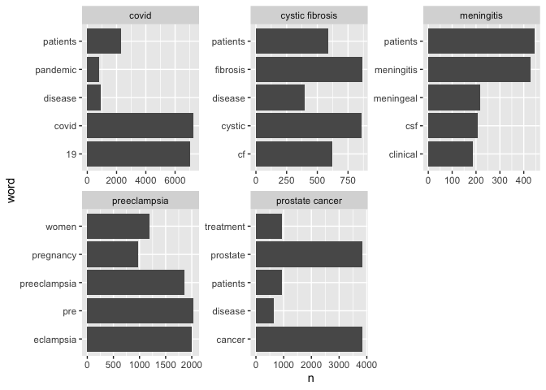
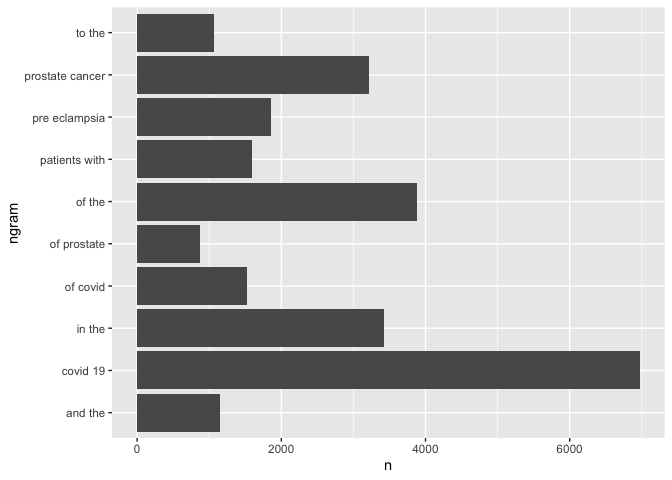
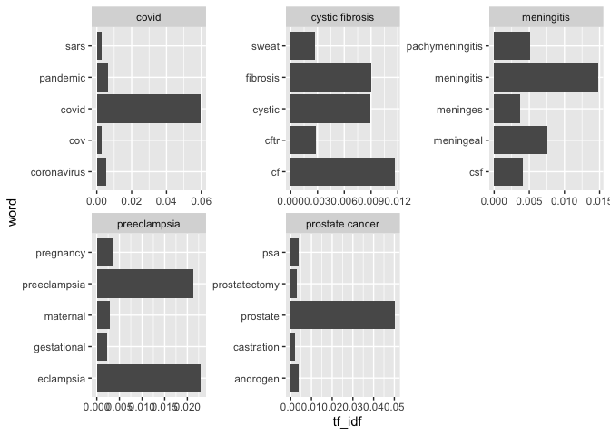

HW3
================
Mingxi Xu
11/4/2021

``` r
knitr::opts_chunk$set(include  = TRUE, echo=FALSE)
library(xml2)
library(stringr)
library(httr)
library(tidyverse)
```

    ## ── Attaching packages ─────────────────────────────────────── tidyverse 1.3.1 ──

    ## ✓ ggplot2 3.3.5     ✓ purrr   0.3.4
    ## ✓ tibble  3.1.3     ✓ dplyr   1.0.7
    ## ✓ tidyr   1.1.3     ✓ forcats 0.5.1
    ## ✓ readr   2.0.1

    ## ── Conflicts ────────────────────────────────────────── tidyverse_conflicts() ──
    ## x dplyr::filter() masks stats::filter()
    ## x dplyr::lag()    masks stats::lag()

# APIs

-   Using the NCBI API, look for papers that show up under the term
    “sars-cov-2 trial vaccine.” Look for the data in the pubmed
    database, and then retrieve the details of the paper as shown in
    lab 7. How many papers were you able to find?

<!-- -->

    ## [1] "2,329"

I am able to find <span class="value">2,329</span> papers.

-   Using the list of pubmed ids you retrieved, download each papers’
    details using the query parameter rettype = abstract. If you get
    more than 250 ids, just keep the first 250.

-   As we did in lab 7. Create a dataset containing the following:

1.  Pubmed ID number,
2.  Title of the paper,
3.  Name of the journal where it was published,
4.  Publication date, and
5.  Abstract of the paper (if any).

**Only the first five data records are shown**

| PubMedID | Title                                                                                                                             | Journal                                  | Date        | Abstracts                                                                                                                                                                                                                                                                                                                                                                                                                                                                                                                                                                                                                                                                                                                                                                                                                                                                                                                                                                                                                                                                                 |
|:---------|:----------------------------------------------------------------------------------------------------------------------------------|:-----------------------------------------|:------------|:------------------------------------------------------------------------------------------------------------------------------------------------------------------------------------------------------------------------------------------------------------------------------------------------------------------------------------------------------------------------------------------------------------------------------------------------------------------------------------------------------------------------------------------------------------------------------------------------------------------------------------------------------------------------------------------------------------------------------------------------------------------------------------------------------------------------------------------------------------------------------------------------------------------------------------------------------------------------------------------------------------------------------------------------------------------------------------------|
| 34729549 | Adverse events of active and placebo groups in SARS-CoV-2 vaccine randomized trials: A systematic review.                         | The Lancet regional health. Europe       | 2021 Oct 28 | NA                                                                                                                                                                                                                                                                                                                                                                                                                                                                                                                                                                                                                                                                                                                                                                                                                                                                                                                                                                                                                                                                                        |
| 34726743 | Analysis of the Effectiveness of the Ad26.COV2.S Adenoviral Vector Vaccine for Preventing COVID-19.                               | JAMA network open                        | 2021 Nov 01 | NA                                                                                                                                                                                                                                                                                                                                                                                                                                                                                                                                                                                                                                                                                                                                                                                                                                                                                                                                                                                                                                                                                        |
| 34715931 | Lessons from Israel’s COVID-19 Green Pass program.                                                                                | Israel journal of health policy research | 2021 10 29  | As of the beginning of March 2021, Israeli law requires the presentation of a Green Pass as a precondition for entering certain businesses and public spheres. Entitlement for a Green Pass is granted to Israelis who have been vaccinated with two doses of COVID-19 vaccine, who have recovered from COVID-19, or who are participating in a clinical trial for vaccine development in Israel. The Green Pass is essential for retaining immune individuals’ freedom of movement and for promoting the public interest in reopening the economic, educational, and cultural spheres of activity. Nonetheless, and as the Green Pass imposes restrictions on the movement of individuals who had not been vaccinated or who had not recovered, it is not consonant with solidarity and trust building. Implementing the Green Pass provision while advancing its effectiveness on the one hand, and safeguarding equality, proportionality, and fairness on the other hand may imbue this measure with ethical legitimacy despite involving a potential breach of trust and solidarity. |
| 34713912 | Vaccine development and technology for SARS-CoV-2: current insights.                                                              | Journal of medical virology              | 2021 Oct 29 | NA                                                                                                                                                                                                                                                                                                                                                                                                                                                                                                                                                                                                                                                                                                                                                                                                                                                                                                                                                                                                                                                                                        |
| 34711598 | BCG vaccination to reduce the impact of COVID-19 in healthcare workers: Protocol for a randomised controlled trial (BRACE trial). | BMJ open                                 | 2021 10 28  | NA                                                                                                                                                                                                                                                                                                                                                                                                                                                                                                                                                                                                                                                                                                                                                                                                                                                                                                                                                                                                                                                                                        |

# Text Mining

A new dataset has been added to the data science data repository
<https://github.com/USCbiostats/data-science-data/tree/master/03_pubmed>.
The dataset contains 3241 abstracts from articles across 5 search terms.
Your job is to analyse these abstracts to find interesting insights.

    ## Rows: 3241 Columns: 2

    ## ── Column specification ────────────────────────────────────────────────────────
    ## Delimiter: ","
    ## chr (2): abstract, term

    ## 
    ## ℹ Use `spec()` to retrieve the full column specification for this data.
    ## ℹ Specify the column types or set `show_col_types = FALSE` to quiet this message.

Tokenize the abstracts and count the number of each token. Do you see
anything interesting? Does removing stop words change what tokens appear
as the most frequent? What are the 5 most common tokens for each search
term after removing stopwords?

    ## # A tibble: 20,567 × 2
    ##    word      n
    ##    <chr> <int>
    ##  1 the   28126
    ##  2 of    24760
    ##  3 and   19993
    ##  4 in    14653
    ##  5 to    10920
    ##  6 a      8245
    ##  7 with   8038
    ##  8 covid  7275
    ##  9 19     7080
    ## 10 is     5649
    ## # … with 20,557 more rows

Before removing stop words, the tokenized words are not informative, top
words are the, of, and, etc. They are not interesting.

<!-- -->

Removing stop words significantly change what appear as the most
frequent. The 5 most common tokens for each search term after removing
stopwords are shown in the graph.

Tokenize the abstracts into bigrams. Find the 10 most common bigram and
visualize them with ggplot2.

<!-- -->

Calculate the TF-IDF value for each word-search term combination. (here
you want the search term to be the “document”) What are the 5 tokens
from each search term with the highest TF-IDF value? How are the results
different from the answers you got in question 1?

<!-- -->

The 5 tokens from each search term with the highest IF\_IDF value is
shown in the graph. The results are different with that of the question
1 because they are more informative and more related with the search
term. TF\_IDF may be more effective than simple word counts since it
intergrates the IDF which can downweight the importance of TF.
