lab11
================
Mingxi Xu
11/5/2021

# Learning Goals

-   Read in and process the COVID dataset from the New York Times GitHub
    repository
-   Create interactive graphs of different types using `plot_ly()` and
    `ggplotly()` functions
-   Customize the hoverinfo and other plot features
-   Create a Choropleth map using `plot_geo()`
-   Create an interactive table using `DataTable`

# Lab Description

We will work with the COVID data presented in lecture. Recall the
dataset consists of COVID-19 cases and deaths in each US state during
the course of the COVID epidemic. We will explore cases, deaths, and
their population normalized values over time to identify trends.

# Steps

## I. Reading and processing the New York Times (NYT) state-level COVID-19 data

### 1. Read in the data

-   Read in the COVID data with data.table:fread() from the NYT GitHub
    repository:
    “<https://raw.githubusercontent.com/nytimes/covid-19-data/master/us-states.csv>”
-   Read in the state population data with data.table:fread() from the
    repository:
    “<https://raw.githubusercontent.com/COVID19Tracking/associated-data/master/us_census_data/us_census_2018_population_estimates_states.csv>”
-   Merge datasets

``` r
## data extracted from New York Times state-level data from NYT Github repository
# https://github.com/nytimes/covid-19-data
## state-level population information from us_census_data available on GitHub repository:
# https://github.com/COVID19Tracking/associated-data/tree/master/us_census_data
# load COVID state-level data from NYT
### FINISH THE CODE HERE ###
cv_states_readin <- as.data.frame(data.table::fread("https://raw.githubusercontent.com/nytimes/covid-19-data/master/us-states.csv") )
# load state population data
### FINISH THE CODE HERE ###
state_pops_readin <- as.data.frame(data.table::fread("https://raw.githubusercontent.com/COVID19Tracking/associated-data/master/us_census_data/us_census_2018_population_estimates_states.csv"))
state_pops <- state_pops_readin
state_pops$abb <- state_pops$state
state_pops$state <- state_pops$state_name
state_pops$state_name <- NULL
### FINISH THE CODE HERE ###
cv_states <- merge( cv_states_readin, state_pops, by="state")
```

### 2. Look at the data

-   Inspect the dimensions, `head`, and `tail` of the data
-   Inspect the structure of each variables. Are they in the correct
    format?

The data seem to be in correct format, except that date are formatted as
characters not a date format.

``` r
dim(cv_states)
```

    ## [1] 31886     9

``` r
head(cv_states)
```

    ##     state       date fips  cases deaths geo_id population pop_density abb
    ## 1 Alabama 2021-08-15    1 634897  11798      1    4887871    96.50939  AL
    ## 2 Alabama 2021-10-31    1 832047  15573      1    4887871    96.50939  AL
    ## 3 Alabama 2020-08-29    1 123889   2152      1    4887871    96.50939  AL
    ## 4 Alabama 2020-09-24    1 148206   2506      1    4887871    96.50939  AL
    ## 5 Alabama 2021-09-28    1 792632  14155      1    4887871    96.50939  AL
    ## 6 Alabama 2021-10-13    1 810501  14980      1    4887871    96.50939  AL

``` r
tail(cv_states)
```

    ##         state       date fips cases deaths geo_id population pop_density abb
    ## 31881 Wyoming 2021-06-23   56 61776    740     56     577737    5.950611  WY
    ## 31882 Wyoming 2021-02-08   56 52784    624     56     577737    5.950611  WY
    ## 31883 Wyoming 2021-02-19   56 53683    662     56     577737    5.950611  WY
    ## 31884 Wyoming 2021-04-12   56 56988    701     56     577737    5.950611  WY
    ## 31885 Wyoming 2021-04-01   56 56389    700     56     577737    5.950611  WY
    ## 31886 Wyoming 2021-04-11   56 56873    701     56     577737    5.950611  WY

``` r
str(cv_states)
```

    ## 'data.frame':    31886 obs. of  9 variables:
    ##  $ state      : chr  "Alabama" "Alabama" "Alabama" "Alabama" ...
    ##  $ date       : IDate, format: "2021-08-15" "2021-10-31" ...
    ##  $ fips       : int  1 1 1 1 1 1 1 1 1 1 ...
    ##  $ cases      : int  634897 832047 123889 148206 792632 810501 133606 44878 546845 627905 ...
    ##  $ deaths     : int  11798 15573 2152 2506 14155 14980 2277 1007 11249 11765 ...
    ##  $ geo_id     : int  1 1 1 1 1 1 1 1 1 1 ...
    ##  $ population : int  4887871 4887871 4887871 4887871 4887871 4887871 4887871 4887871 4887871 4887871 ...
    ##  $ pop_density: num  96.5 96.5 96.5 96.5 96.5 ...
    ##  $ abb        : chr  "AL" "AL" "AL" "AL" ...

### 3. Format the data

-   Make date into a date variable
-   Make `state` and `abb` into a factor variable
-   Order the data first by state, second by date
-   Confirm the variables are now correctly formatted
-   Inspect the range values for each variable. What is the date range?
    The range of cases and deaths?

date range: from “2020-01-21” to “2020-11-03” range of cases: from 1 to
973517  
range of deaths: from 0 to 33305

``` r
# format the date
cv_states$date <- as.Date(cv_states$date, format="%Y-%m-%d")
# format the state variable
state_list <- unique(cv_states$state)
cv_states$state <- factor(cv_states$state, levels = state_list)
# format the state abbreviation (abb) variable
### FINISH THE CODE HERE ###
abb_list = unique(cv_states$abb)
cv_states$abb = factor(cv_states$abb, levels = abb_list)
  
# order the data first by state, second by date
cv_states = cv_states[order(cv_states$state, cv_states$date),]
# Confirm the variables are now correctly formatted
str(cv_states)
```

    ## 'data.frame':    31886 obs. of  9 variables:
    ##  $ state      : Factor w/ 52 levels "Alabama","Alaska",..: 1 1 1 1 1 1 1 1 1 1 ...
    ##  $ date       : Date, format: "2020-03-13" "2020-03-14" ...
    ##  $ fips       : int  1 1 1 1 1 1 1 1 1 1 ...
    ##  $ cases      : int  6 12 23 29 39 51 78 106 131 157 ...
    ##  $ deaths     : int  0 0 0 0 0 0 0 0 0 0 ...
    ##  $ geo_id     : int  1 1 1 1 1 1 1 1 1 1 ...
    ##  $ population : int  4887871 4887871 4887871 4887871 4887871 4887871 4887871 4887871 4887871 4887871 ...
    ##  $ pop_density: num  96.5 96.5 96.5 96.5 96.5 ...
    ##  $ abb        : Factor w/ 52 levels "AL","AK","AZ",..: 1 1 1 1 1 1 1 1 1 1 ...

``` r
head(cv_states)
```

    ##       state       date fips cases deaths geo_id population pop_density abb
    ## 125 Alabama 2020-03-13    1     6      0      1    4887871    96.50939  AL
    ## 422 Alabama 2020-03-14    1    12      0      1    4887871    96.50939  AL
    ## 107 Alabama 2020-03-15    1    23      0      1    4887871    96.50939  AL
    ## 489 Alabama 2020-03-16    1    29      0      1    4887871    96.50939  AL
    ## 213 Alabama 2020-03-17    1    39      0      1    4887871    96.50939  AL
    ## 46  Alabama 2020-03-18    1    51      0      1    4887871    96.50939  AL

``` r
tail(cv_states)
```

    ##         state       date fips  cases deaths geo_id population pop_density abb
    ## 31327 Wyoming 2021-10-30   56 102926   1174     56     577737    5.950611  WY
    ## 31301 Wyoming 2021-10-31   56 102926   1174     56     577737    5.950611  WY
    ## 31678 Wyoming 2021-11-01   56 103622   1174     56     577737    5.950611  WY
    ## 31735 Wyoming 2021-11-02   56 103989   1243     56     577737    5.950611  WY
    ## 31666 Wyoming 2021-11-03   56 104403   1243     56     577737    5.950611  WY
    ## 31601 Wyoming 2021-11-04   56 104940   1243     56     577737    5.950611  WY

``` r
# Inspect the range values for each variable. What is the date range? The range of cases and deaths?
head(cv_states)
```

    ##       state       date fips cases deaths geo_id population pop_density abb
    ## 125 Alabama 2020-03-13    1     6      0      1    4887871    96.50939  AL
    ## 422 Alabama 2020-03-14    1    12      0      1    4887871    96.50939  AL
    ## 107 Alabama 2020-03-15    1    23      0      1    4887871    96.50939  AL
    ## 489 Alabama 2020-03-16    1    29      0      1    4887871    96.50939  AL
    ## 213 Alabama 2020-03-17    1    39      0      1    4887871    96.50939  AL
    ## 46  Alabama 2020-03-18    1    51      0      1    4887871    96.50939  AL

``` r
summary(cv_states)
```

    ##            state            date                 fips           cases        
    ##  Washington   :  654   Min.   :2020-01-21   Min.   : 1.00   Min.   :      1  
    ##  Illinois     :  651   1st Qu.:2020-08-02   1st Qu.:16.00   1st Qu.:  30819  
    ##  California   :  650   Median :2021-01-02   Median :29.00   Median : 143554  
    ##  Arizona      :  649   Mean   :2021-01-01   Mean   :29.78   Mean   : 380802  
    ##  Massachusetts:  643   3rd Qu.:2021-06-04   3rd Qu.:44.00   3rd Qu.: 473906  
    ##  Wisconsin    :  639   Max.   :2021-11-04   Max.   :72.00   Max.   :4951476  
    ##  (Other)      :28000                                                         
    ##      deaths          geo_id        population        pop_density       
    ##  Min.   :    0   Min.   : 1.00   Min.   :  577737   Min.   :    1.292  
    ##  1st Qu.:  607   1st Qu.:16.00   1st Qu.: 1805832   1st Qu.:   43.659  
    ##  Median : 2614   Median :29.00   Median : 4468402   Median :  107.860  
    ##  Mean   : 7071   Mean   :29.78   Mean   : 6434819   Mean   :  422.499  
    ##  3rd Qu.: 8324   3rd Qu.:44.00   3rd Qu.: 7535591   3rd Qu.:  229.511  
    ##  Max.   :72559   Max.   :72.00   Max.   :39557045   Max.   :11490.120  
    ##                                                     NA's   :602        
    ##       abb       
    ##  WA     :  654  
    ##  IL     :  651  
    ##  CA     :  650  
    ##  AZ     :  649  
    ##  MA     :  643  
    ##  WI     :  639  
    ##  (Other):28000

``` r
min(cv_states$date)
```

    ## [1] "2020-01-21"

``` r
max(cv_states$date)
```

    ## [1] "2021-11-04"

### 4. Add `new_cases` and `new_deaths` and correct outliers

-   Add variables for new cases, `new_cases`, and new deaths,
    `new_deaths`:
    -   Hint: `new_cases` is equal to the difference between cases on
        date i and date i-1, starting on date i=2
-   Use `plotly` for EDA: See if there are outliers or values that don’t
    make sense for `new_cases` and `new_deaths`. Which states and which
    dates have strange values?

Based on the plot, it seems to have no outliers or values.

-   Correct outliers: Set negative values for `new_cases` or
    `new_deaths` to 0

-   Recalculate `cases` and `deaths` as cumulative sum of updates
    `new_cases` and `new_deaths`

``` r
# Add variables for new_cases and new_deaths:
for (i in 1:length(state_list)) {
  cv_subset = subset(cv_states, state == state_list[i])
  cv_subset = cv_subset[order(cv_subset$date),]
  # add starting level for new cases and deaths
  cv_subset$new_cases = cv_subset$cases[1]
  cv_subset$new_deaths = cv_subset$deaths[1]
  #### FINISH THE CODE HERE ###
  for (j in 2:nrow(cv_subset)) {
    cv_subset$new_cases[j] = cv_subset$cases[j] - cv_subset$cases[j-1] 
    cv_subset$new_deaths[j] = cv_subset$deaths[j] - cv_subset$deaths[j-1]
  }
  # include in main dataset
  cv_states$new_cases[cv_states$state==state_list[i]] = cv_subset$new_cases
  cv_states$new_deaths[cv_states$state==state_list[i]] = cv_subset$new_deaths
}
# Inspect outliers in new_cases and new_deaths using plotly
### FINISH THE CODE HERE ###
p1<-ggplot(cv_states, 
           aes( x=date, y=new_cases, color=state  )
           ) + geom_line() + geom_point(size = .5, alpha = 0.5)
ggplotly(p1)
```

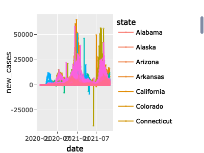

``` r
p1<-NULL # to clear from workspace
### FINISH THE CODE HERE ###
p2<-ggplot(cv_states, 
           aes(x=date, y=new_deaths, color=state )
           ) + geom_line() + geom_point(size = .5, alpha = 0.5)
ggplotly(p2)
```

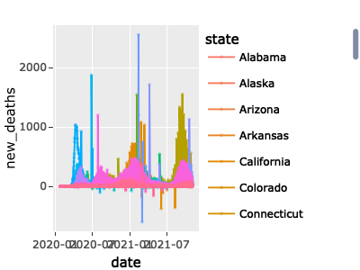

``` r
p2<-NULL # to clear from workspace
# set negative new case or death counts to 0
cv_states$new_cases[cv_states$new_cases<0] = 0
cv_states$new_deaths[cv_states$new_deaths<0] = 0
# Recalculate `cases` and `deaths` as cumulative sum of updates `new_cases` and `new_deaths`
for (i in 1:length(state_list)) {
  cv_subset = subset(cv_states, state == state_list[i])
  # add starting level for new cases and deaths
  cv_subset$cases = cv_subset$cases[1]
  cv_subset$deaths = cv_subset$deaths[1]
  for (j in 2:nrow(cv_subset)) {
    cv_subset$cases[j] = cv_subset$new_cases[j] + cv_subset$cases[j-1]
    cv_subset$deaths[j] = cv_subset$new_deaths[j] + cv_subset$deaths[j-1]
  }
  # include in main dataset
  cv_states$cases[cv_states$state==state_list[i]] = cv_subset$cases
  cv_states$deaths[cv_states$state==state_list[i]] = cv_subset$deaths
}
```

### 5. Add additional variables

-   Add population-normalized (by 100,000) variables for each variable
    type (rounded to 1 decimal place). Make sure the variables you
    calculate are in the correct format (`numeric`). You can use the
    following variable names:

    -   `per100k` = cases per 100,000 population
    -   `newper100k`= new cases per 100,000
    -   `deathsper100k` = deaths per 100,000
    -   `newdeathsper100k` = new deaths per 100,000

-   Add a “naive CFR” variable representing `deaths / cases` on each
    date for each state

-   Create a dataframe representing values on the most recent date,
    `cv_states_today`, as done in lecture

``` r
# add population normalized (by 100,000) counts for each variable
cv_states$per100k =  as.numeric(format(round(cv_states$cases/(cv_states$population/100000),1),nsmall=1))
cv_states$newper100k =  as.numeric(format(round(cv_states$new_cases/(cv_states$population/100000),1),nsmall=1))
cv_states$deathsper100k =  as.numeric(format(round(cv_states$deaths/(cv_states$population/100000),1),nsmall=1))
cv_states$newdeathsper100k =  as.numeric(format(round(cv_states$new_deaths/(cv_states$population/100000),1),nsmall=1))
# add a naive_CFR variable = deaths / cases
cv_states = cv_states %>% mutate(naive_CFR = round((deaths*100/cases),2))
# create a `cv_states_today` variable
### FINISH THE CODE HERE ###
max_date <- max(cv_states$date)
cv_states_today = cv_states %>% filter(date==as.Date(max_date))
```

## II. Interactive plots

### 6. Explore scatterplots using `plot_ly()`

-   Create a scatterplot using `plot_ly()` representing `pop_density`
    vs. various variables (e.g. `cases`, `per100k`, `deaths`,
    `deathsper100k`) for each state on most recent date
    (`cv_states_today`)
    -   Use hover to identify any outliers.
    -   Remove those outliers and replot.
-   Choose one plot. For this plot:
    -   Add hoverinfo specifying the state name, cases per 100k, and
        deaths per 100k, similarly to how we did this in the lecture
        notes
    -   Add layout information to title the chart and the axes
    -   Enable `hovermode = "compare"`

``` r
# pop_density vs. cases
### FINISH THE CODE HERE ###
cv_states_today %>% 
  plot_ly(x = ~pop_density, y = ~cases, 
          type = 'scatter', mode = 'markers', color = ~state,
          size = ~population, sizes = c(5, 70), marker = list(sizemode='diameter', opacity=0.5))
```

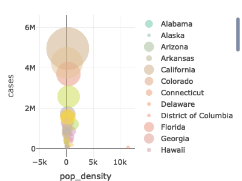

``` r
# filter out "District of Columbia"
cv_states_today_scatter <- cv_states_today %>% filter(state!="District of Columbia")
# pop_density vs. cases after filtering
cv_states_today_scatter %>% 
  plot_ly(x = ~pop_density, y = ~cases, 
          type = 'scatter', mode = 'markers', color = ~state,
          size = ~population, sizes = c(5, 70), marker = list(sizemode='diameter', opacity=0.5))
```

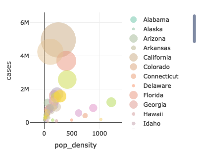

``` r
# pop_density vs. deathsper100k
cv_states_today_scatter %>% 
  plot_ly(x = ~pop_density, y = ~newdeathsper100k, 
          type = 'scatter', mode = 'markers', color = ~state,
          size = ~population, sizes = c(5, 70), marker = list(sizemode='diameter', opacity=0.5))
```

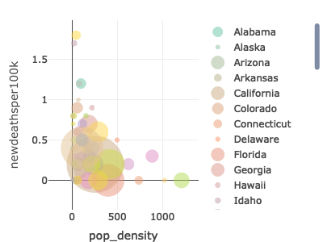

``` r
# Adding hoverinfo
cv_states_today_scatter %>% 
  plot_ly(x = ~pop_density, y = ~deathsper100k,
          type = 'scatter', mode = 'markers', color = ~state,
          size = ~population, sizes = c(5, 70), marker = list(sizemode='diameter', opacity=0.5),
          hoverinfo = 'text',
          text = ~paste( paste(state, ":", sep=""), paste(" Cases per 100k: ", per100k, sep="") , paste(" Deaths per 100k: ",
                        deathsper100k, sep=""), sep = "<br>")) %>%
  layout(title = "Population-normalized COVID-19 deaths (per 100k) vs. population density for US states",
                  yaxis = list(title = "Deaths per 100k"), xaxis = list(title = "Population Density"),
         hovermode = "compare")
```

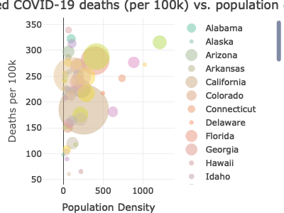

### 7. Explore scatterplot trend interactively using `ggplotly()` and `geom_smooth()`

-   For `pop_density` vs. `newdeathsper100k` create a chart with the
    same variables using `gglot_ly()`

-   What’s the `geom_*()` we need here? we use geom\_point hear.

-   Explore the pattern between *x* and *y* using `geom_smooth()`

    -   Explain what you see. Do you think `pop_density` is a correlate
        of `newdeathsper100k`?

    They might be very weakly negatively correlated, but not very clear
    from the plot.

``` r
### FINISH THE CODE HERE ###
p <- ggplot(cv_states_today_scatter, aes(x=pop_density, y=per100k, color=state, size=population)) + geom_point() + geom_smooth() 
ggplotly(p)
```

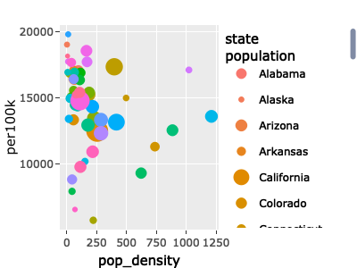

### 8. Multiple line chart

-   Create a line chart of the `naive_CFR` for all states over time
    using `plot_ly()`
    -   Use hoverinfo to identify states that had a “first peak”: the
        washingtion state
    -   Use the zoom and pan tools to inspect the `naive_CFR` for the
        states that had a “first peak” in September. How have they
        changed over time? Connecticut state. It almost kept constant.
-   Create one more line chart, for Texas only, which shows `new_cases`
    and `new_deaths` together in one plot. Hint: use `add_lines()`
    -   Use hoverinfo to “eyeball” the approximate peak of deaths and
        peak of cases. What is the time delay between the peak of cases
        and the peak of deaths?

        the peak of cases: Sep 21, the peak of deaths: Juy 27, the time
        delay: nearly two months.

``` r
# Line chart for naive_CFR for all states over time using `plot_ly()`
plot_ly(cv_states, x = ~date, y = ~naive_CFR, color = ~state, type = "scatter", mode = "lines")
```

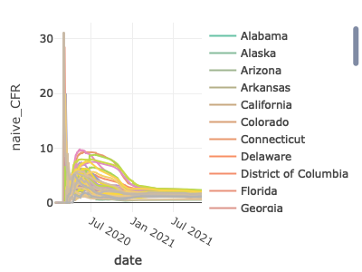

``` r
# Line chart for Texas showing new_cases and new_deaths together
### FINISH THE CODE HERE ###
cv_states %>% filter(state=="Texas") %>% plot_ly(x = ~date, y = ~new_cases, type = "scatter", mode = "lines") %>% add_lines(x = ~date, y = ~new_deaths, type = "scatter", mode = "lines")
```

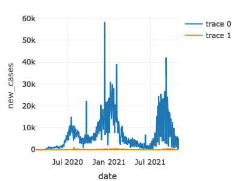

### 9. Heatmaps

Create a heatmap to visualize `new_cases` for each state on each date
greater than April 1st, 2020 - Start by mapping selected features in the
dataframe into a matrix using the **tidyr** package function
`pivot_wider()`, naming the rows and columns, as done in the lecture
notes - Use `plot_ly()` to create a heatmap out of this matrix

-   Create a second heatmap in which the pattern of `new_cases` for each
    state over time becomes more clear by filtering to only look at
    dates every two weeks

``` r
# Map state, date, and new_cases to a matrix
library(tidyr)
cv_states_mat <- cv_states %>% select(state, date, new_cases) %>% filter(date>as.Date("2020-04-01"))
cv_states_mat2 <- as.data.frame(pivot_wider(cv_states_mat, names_from = state, values_from = new_cases))
rownames(cv_states_mat2) <- cv_states_mat2$date
cv_states_mat2$date <- NULL
cv_states_mat2 <- as.matrix(cv_states_mat2)
# Create a heatmap using plot_ly()
plot_ly(x=colnames(cv_states_mat2), y=rownames(cv_states_mat2),
             z=~cv_states_mat2,
             type="heatmap",
             showscale=T)
```

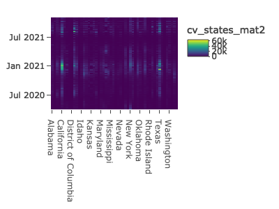

``` r
# Create a second heatmap after filtering to only include dates every other week
filter_dates <- seq(as.Date("2020-04-01"), as.Date("2020-10-01"), by="2 weeks")
### FINISH THE CODE HERE ### 
cv_states_mat <- cv_states %>% select(state, date, new_cases) %>% filter( date %in% filter_dates )
cv_states_mat2 <- as.data.frame(pivot_wider(cv_states_mat, names_from = state, values_from = new_cases))
rownames(cv_states_mat2) <- cv_states_mat2$date
cv_states_mat2$date <- NULL
cv_states_mat2 <- as.matrix(cv_states_mat2)
# Create a heatmap using plot_ly()
plot_ly(x=colnames(cv_states_mat2), y=rownames(cv_states_mat2),
             z=~cv_states_mat2,
             type="heatmap",
             showscale=T)
```

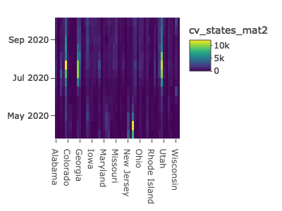

### 10. Map

-   Create a map to visualize the `naive_CFR` by state on May 1st, 2020
-   Compare with a map visualizing the `naive_CFR` by state on most
    recent date
-   Plot the two maps side by side using `subplot()`. Make sure the
    shading is for the same range of values (google is your friend for
    this)
-   Describe the difference in the pattern of the CFR.

``` r
### For May 1 2020
# Extract the data for each state by its abbreviation
cv_CFR <- cv_states %>% filter(date=="2020-05-01") %>% select(state, abb, naive_CFR, cases, deaths) # select data
cv_CFR$state_name <- cv_CFR$state
cv_CFR$state <- cv_CFR$abb
cv_CFR$abb <- NULL
# Create hover text
cv_CFR$hover <- with(cv_CFR, paste(state_name, '<br>', "CFR: ", naive_CFR, '<br>', "Cases: ", cases, '<br>', "Deaths: ", deaths))
# Set up mapping details
set_map_details <- list(
  scope = 'usa',
  projection = list(type = 'albers usa'),
  showlakes = TRUE,
  lakecolor = toRGB('white')
)
# Make sure both maps are on the same color scale
shadeLimit <- 9
# Create the map
fig <- plot_geo(cv_CFR, locationmode = 'USA-states') %>% 
  add_trace(
    z = ~naive_CFR, text = ~hover, locations = ~state,
    color = ~naive_CFR, colors = 'Purples'
  )
fig <- fig %>% colorbar(title = "CFR May 1 2020", limits = c(0,shadeLimit))
fig <- fig %>% layout(
    title = paste('CFR by State as of', Sys.Date(), '<br>(Hover for value)'),
    geo = set_map_details
  )
fig_May1 <- fig
#############
### For Today
# Extract the data for each state by its abbreviation
cv_CFR <- cv_states_today %>%  select(state, abb, naive_CFR, cases, deaths) # select data
cv_CFR$state_name <- cv_CFR$state
cv_CFR$state <- cv_CFR$abb
cv_CFR$abb <- NULL
# Create hover text
cv_CFR$hover <- with(cv_CFR, paste(state_name, '<br>', "CFR: ", naive_CFR, '<br>', "Cases: ", cases, '<br>', "Deaths: ", deaths))
# Set up mapping details
set_map_details <- list(
  scope = 'usa',
  projection = list(type = 'albers usa'),
  showlakes = TRUE,
  lakecolor = toRGB('white')
)
# Create the map
fig <- plot_geo(cv_CFR, locationmode = 'USA-states') %>% 
  add_trace(
    z = ~naive_CFR, text = ~hover, locations = ~state,
    color = ~naive_CFR, colors = 'Purples'
  )
fig <- fig %>% colorbar(title = "CFR May 1 2020", limits = c(0,shadeLimit))
fig <- fig %>% layout(
    title = paste('CFR by State as of', Sys.Date(), '<br>(Hover for value)'),
    geo = set_map_details
  )
fig_Today <- fig
### Plot side by side 
### FINISH THE CODE HERE ###
subplot( fig_May1, fig_Today )
```

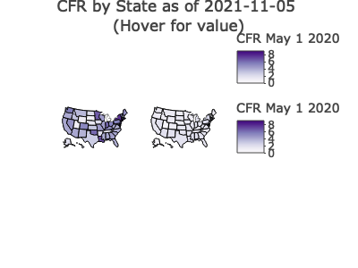
