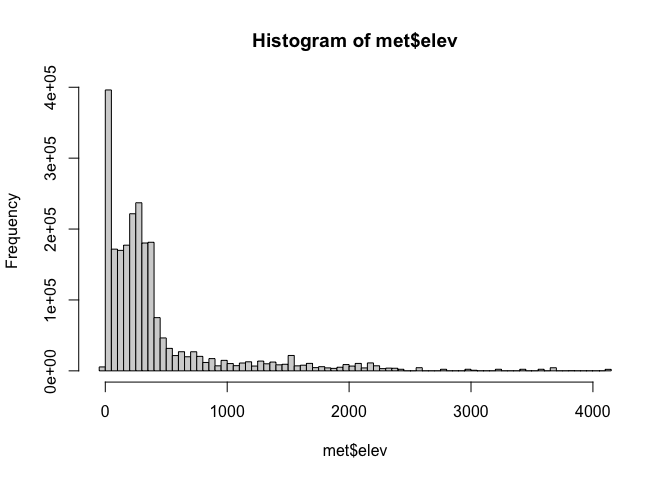

```{r setup, include=FALSE}
knitr::opts_chunk$set(echo = TRUE)
library("dplyr")
```

## Exploratory Data Analysis 

### Read the data

```{r}
if(!require(data.table)) {
  install.packages("data.table")
}

if(!file.exists("met_all.gz")) {
  download.file("https://raw.githubusercontent.com/USCbiostats/data-science-data/master/02_met/met_all.gz", "met_all.gz", method="libcurl", timeout = 60)
}
met <- data.table::fread("met_all.gz")
```

### check the basic properties

```{r}
dim(met)
head(met)
tail(met)
```

### take a look at variables

```{r}
str(met)
```

### take a closer look at key variables

```{r}
table(met$year)
table(met$day)
table(met$hour)
summary(met$temp)
summary(met$elev)
summary(met$wind.sp)
```

### modifications

```{r}
met[met$elev == 9999] <- NA
summary(met$elev)
```
the highest weather station is at `r max(met$elev, na.rm = TRUE)` `r ifelse(runif(1) > .5, "ft", "mts")`
```{r}
met <- met[met$temp > -40]
met2 <- met[order(temp)]
head(met2)
```
    the suspicious temperature value is at site 722817
    
```{r}
met <- met[met$elev >= -13]
met <- met[met$elev <= 4113]
met3 <- met[order(elev)]
head(met3)
tail(met3)
```
---
```{r}
met <- met[temp>-15]
met2 <- met[order(temp)]
head(met2)
```

### calculate the summary statistics

```{r}
elev <- met[elev==max(elev, na.rm = TRUE)]
summary(elev$temp)
met[elev==max(elev, na.rm = TRUE), .(
  temp_wind = cor(temp, wind.sp, use="complete"),
temp_hour = cor(temp, hour, use="complete"),
wind.sp_day = cor(wind.sp, day, use="complete"),
wind.sp_hour = cor(wind.sp, hour, use="complete"),
temp_day = cor(temp, day, use="complete")
)]

```

### Exploratory graphs

```{r}
hist(met$elev, breaks=100)
```


```{r}
hist(met$temp)
```

```{r}
hist(met$wind.sp)
```

