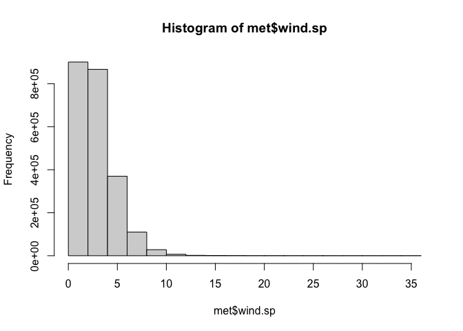

Exercise
================
Mingxi Xu
2021/9/10

## Exploratory Data Analysis

### Read the data

``` r
if(!require(data.table)) {
  install.packages("data.table")
}
```

    ## 载入需要的程辑包：data.table

    ## 
    ## 载入程辑包：'data.table'

    ## The following objects are masked from 'package:dplyr':
    ## 
    ##     between, first, last

``` r
if(!file.exists("met_all.gz")) {
  download.file("https://raw.githubusercontent.com/USCbiostats/data-science-data/master/02_met/met_all.gz", "met_all.gz", method="libcurl", timeout = 60)
}
met <- data.table::fread("met_all.gz")
```

### check the basic properties

``` r
dim(met)
```

    ## [1] 2377343      30

``` r
head(met)
```

    ##    USAFID  WBAN year month day hour min  lat      lon elev wind.dir wind.dir.qc
    ## 1: 690150 93121 2019     8   1    0  56 34.3 -116.166  696      220           5
    ## 2: 690150 93121 2019     8   1    1  56 34.3 -116.166  696      230           5
    ## 3: 690150 93121 2019     8   1    2  56 34.3 -116.166  696      230           5
    ## 4: 690150 93121 2019     8   1    3  56 34.3 -116.166  696      210           5
    ## 5: 690150 93121 2019     8   1    4  56 34.3 -116.166  696      120           5
    ## 6: 690150 93121 2019     8   1    5  56 34.3 -116.166  696       NA           9
    ##    wind.type.code wind.sp wind.sp.qc ceiling.ht ceiling.ht.qc ceiling.ht.method
    ## 1:              N     5.7          5      22000             5                 9
    ## 2:              N     8.2          5      22000             5                 9
    ## 3:              N     6.7          5      22000             5                 9
    ## 4:              N     5.1          5      22000             5                 9
    ## 5:              N     2.1          5      22000             5                 9
    ## 6:              C     0.0          5      22000             5                 9
    ##    sky.cond vis.dist vis.dist.qc vis.var vis.var.qc temp temp.qc dew.point
    ## 1:        N    16093           5       N          5 37.2       5      10.6
    ## 2:        N    16093           5       N          5 35.6       5      10.6
    ## 3:        N    16093           5       N          5 34.4       5       7.2
    ## 4:        N    16093           5       N          5 33.3       5       5.0
    ## 5:        N    16093           5       N          5 32.8       5       5.0
    ## 6:        N    16093           5       N          5 31.1       5       5.6
    ##    dew.point.qc atm.press atm.press.qc       rh
    ## 1:            5    1009.9            5 19.88127
    ## 2:            5    1010.3            5 21.76098
    ## 3:            5    1010.6            5 18.48212
    ## 4:            5    1011.6            5 16.88862
    ## 5:            5    1012.7            5 17.38410
    ## 6:            5    1012.7            5 20.01540

``` r
tail(met)
```

    ##    USAFID  WBAN year month day hour min    lat      lon elev wind.dir
    ## 1: 726813 94195 2019     8  31   18  56 43.650 -116.633  741       NA
    ## 2: 726813 94195 2019     8  31   19  56 43.650 -116.633  741       70
    ## 3: 726813 94195 2019     8  31   20  56 43.650 -116.633  741       NA
    ## 4: 726813 94195 2019     8  31   21  56 43.650 -116.633  741       10
    ## 5: 726813 94195 2019     8  31   22  56 43.642 -116.636  741       10
    ## 6: 726813 94195 2019     8  31   23  56 43.642 -116.636  741       40
    ##    wind.dir.qc wind.type.code wind.sp wind.sp.qc ceiling.ht ceiling.ht.qc
    ## 1:           9              C     0.0          5      22000             5
    ## 2:           5              N     2.1          5      22000             5
    ## 3:           9              C     0.0          5      22000             5
    ## 4:           5              N     2.6          5      22000             5
    ## 5:           1              N     2.1          1      22000             1
    ## 6:           1              N     2.1          1      22000             1
    ##    ceiling.ht.method sky.cond vis.dist vis.dist.qc vis.var vis.var.qc temp
    ## 1:                 9        N    16093           5       N          5 30.0
    ## 2:                 9        N    16093           5       N          5 32.2
    ## 3:                 9        N    16093           5       N          5 33.3
    ## 4:                 9        N    14484           5       N          5 35.0
    ## 5:                 9        N    16093           1       9          9 34.4
    ## 6:                 9        N    16093           1       9          9 34.4
    ##    temp.qc dew.point dew.point.qc atm.press atm.press.qc       rh
    ## 1:       5      11.7            5    1013.6            5 32.32509
    ## 2:       5      12.2            5    1012.8            5 29.40686
    ## 3:       5      12.2            5    1011.6            5 27.60422
    ## 4:       5       9.4            5    1010.8            5 20.76325
    ## 5:       1       9.4            1    1010.1            1 21.48631
    ## 6:       1       9.4            1    1009.6            1 21.48631

### take a look at variables

``` r
str(met)
```

    ## Classes 'data.table' and 'data.frame':   2377343 obs. of  30 variables:
    ##  $ USAFID           : int  690150 690150 690150 690150 690150 690150 690150 690150 690150 690150 ...
    ##  $ WBAN             : int  93121 93121 93121 93121 93121 93121 93121 93121 93121 93121 ...
    ##  $ year             : int  2019 2019 2019 2019 2019 2019 2019 2019 2019 2019 ...
    ##  $ month            : int  8 8 8 8 8 8 8 8 8 8 ...
    ##  $ day              : int  1 1 1 1 1 1 1 1 1 1 ...
    ##  $ hour             : int  0 1 2 3 4 5 6 7 8 9 ...
    ##  $ min              : int  56 56 56 56 56 56 56 56 56 56 ...
    ##  $ lat              : num  34.3 34.3 34.3 34.3 34.3 34.3 34.3 34.3 34.3 34.3 ...
    ##  $ lon              : num  -116 -116 -116 -116 -116 ...
    ##  $ elev             : int  696 696 696 696 696 696 696 696 696 696 ...
    ##  $ wind.dir         : int  220 230 230 210 120 NA 320 10 320 350 ...
    ##  $ wind.dir.qc      : chr  "5" "5" "5" "5" ...
    ##  $ wind.type.code   : chr  "N" "N" "N" "N" ...
    ##  $ wind.sp          : num  5.7 8.2 6.7 5.1 2.1 0 1.5 2.1 2.6 1.5 ...
    ##  $ wind.sp.qc       : chr  "5" "5" "5" "5" ...
    ##  $ ceiling.ht       : int  22000 22000 22000 22000 22000 22000 22000 22000 22000 22000 ...
    ##  $ ceiling.ht.qc    : int  5 5 5 5 5 5 5 5 5 5 ...
    ##  $ ceiling.ht.method: chr  "9" "9" "9" "9" ...
    ##  $ sky.cond         : chr  "N" "N" "N" "N" ...
    ##  $ vis.dist         : int  16093 16093 16093 16093 16093 16093 16093 16093 16093 16093 ...
    ##  $ vis.dist.qc      : chr  "5" "5" "5" "5" ...
    ##  $ vis.var          : chr  "N" "N" "N" "N" ...
    ##  $ vis.var.qc       : chr  "5" "5" "5" "5" ...
    ##  $ temp             : num  37.2 35.6 34.4 33.3 32.8 31.1 29.4 28.9 27.2 26.7 ...
    ##  $ temp.qc          : chr  "5" "5" "5" "5" ...
    ##  $ dew.point        : num  10.6 10.6 7.2 5 5 5.6 6.1 6.7 7.8 7.8 ...
    ##  $ dew.point.qc     : chr  "5" "5" "5" "5" ...
    ##  $ atm.press        : num  1010 1010 1011 1012 1013 ...
    ##  $ atm.press.qc     : int  5 5 5 5 5 5 5 5 5 5 ...
    ##  $ rh               : num  19.9 21.8 18.5 16.9 17.4 ...
    ##  - attr(*, ".internal.selfref")=<externalptr>

### take a closer look at key variables

``` r
table(met$year)
```

    ## 
    ##    2019 
    ## 2377343

``` r
table(met$day)
```

    ## 
    ##     1     2     3     4     5     6     7     8     9    10    11    12    13 
    ## 75975 75923 76915 76594 76332 76734 77677 77766 75366 75450 76187 75052 76906 
    ##    14    15    16    17    18    19    20    21    22    23    24    25    26 
    ## 77852 76217 78015 78219 79191 76709 75527 75786 78312 77413 76965 76806 79114 
    ##    27    28    29    30    31 
    ## 79789 77059 71712 74931 74849

``` r
table(met$hour)
```

    ## 
    ##      0      1      2      3      4      5      6      7      8      9     10 
    ##  99434  93482  93770  96703 110504 112128 106235 101985 100310 102915 101880 
    ##     11     12     13     14     15     16     17     18     19     20     21 
    ## 100470 103605  97004  96507  97635  94942  94184 100179  94604  94928  96070 
    ##     22     23 
    ##  94046  93823

``` r
summary(met$temp)
```

    ##    Min. 1st Qu.  Median    Mean 3rd Qu.    Max.    NA's 
    ##  -40.00   19.60   23.50   23.59   27.80   56.00   60089

``` r
summary(met$elev)
```

    ##    Min. 1st Qu.  Median    Mean 3rd Qu.    Max. 
    ##   -13.0   101.0   252.0   415.8   400.0  9999.0

``` r
summary(met$wind.sp)
```

    ##    Min. 1st Qu.  Median    Mean 3rd Qu.    Max.    NA's 
    ##    0.00    0.00    2.10    2.46    3.60   36.00   79693

### modifications

``` r
met[met$elev == 9999] <- NA
summary(met$elev)
```

    ##    Min. 1st Qu.  Median    Mean 3rd Qu.    Max.    NA's 
    ##     -13     101     252     413     400    4113     710

the highest weather station is at 4113 ft

``` r
met <- met[met$temp > -40]
met2 <- met[order(temp)]
head(met2)
```

    ##    USAFID WBAN year month day hour min    lat    lon elev wind.dir wind.dir.qc
    ## 1: 722817 3068 2019     8   1    0  56 38.767 -104.3 1838      190           5
    ## 2: 722817 3068 2019     8   1    1  56 38.767 -104.3 1838      180           5
    ## 3: 722817 3068 2019     8   3   11  56 38.767 -104.3 1838       NA           9
    ## 4: 722817 3068 2019     8   3   12  56 38.767 -104.3 1838       NA           9
    ## 5: 722817 3068 2019     8   6   21  56 38.767 -104.3 1838      280           5
    ## 6: 722817 3068 2019     8   6   22  56 38.767 -104.3 1838      240           5
    ##    wind.type.code wind.sp wind.sp.qc ceiling.ht ceiling.ht.qc ceiling.ht.method
    ## 1:              N     7.2          5         NA             9                 9
    ## 2:              N     7.7          5         NA             9                 9
    ## 3:              C     0.0          5         NA             9                 9
    ## 4:              C     0.0          5         NA             9                 9
    ## 5:              N     2.6          5         NA             9                 9
    ## 6:              N     7.7          5         NA             9                 9
    ##    sky.cond vis.dist vis.dist.qc vis.var vis.var.qc  temp temp.qc dew.point
    ## 1:        N       NA           9       N          5 -17.2       5        NA
    ## 2:        N       NA           9       N          5 -17.2       5        NA
    ## 3:        N       NA           9       N          5 -17.2       5        NA
    ## 4:        N       NA           9       N          5 -17.2       5        NA
    ## 5:        N       NA           9       N          5 -17.2       5        NA
    ## 6:        N       NA           9       N          5 -17.2       5        NA
    ##    dew.point.qc atm.press atm.press.qc rh
    ## 1:            9        NA            9 NA
    ## 2:            9        NA            9 NA
    ## 3:            9        NA            9 NA
    ## 4:            9        NA            9 NA
    ## 5:            9        NA            9 NA
    ## 6:            9        NA            9 NA

    the suspicious temperature value is at site 722817

``` r
met <- met[met$elev >= -13]
met <- met[met$elev <= 4113]
met3 <- met[order(elev)]
head(met3)
```

    ##    USAFID  WBAN year month day hour min    lat      lon elev wind.dir
    ## 1: 722810 23199 2019     8  13    0  56 32.829 -115.672  -13      120
    ## 2: 722810 23199 2019     8  13    1  56 32.829 -115.672  -13      110
    ## 3: 722810 23199 2019     8  13    2  56 32.829 -115.672  -13      130
    ## 4: 722810 23199 2019     8  13    3  56 32.829 -115.672  -13      150
    ## 5: 722810 23199 2019     8  13    6  56 32.829 -115.672  -13      210
    ## 6: 722810 23199 2019     8  30   23  56 32.829 -115.672  -13      110
    ##    wind.dir.qc wind.type.code wind.sp wind.sp.qc ceiling.ht ceiling.ht.qc
    ## 1:           1              N     3.6          1      22000             1
    ## 2:           1              N     4.1          1      22000             1
    ## 3:           1              N     3.1          1      22000             1
    ## 4:           1              N     3.6          1      22000             1
    ## 5:           1              N     2.6          1      22000             1
    ## 6:           1              N     2.6          1      22000             1
    ##    ceiling.ht.method sky.cond vis.dist vis.dist.qc vis.var vis.var.qc temp
    ## 1:                 9        N    16093           1       9          9 40.0
    ## 2:                 9        N    16093           1       9          9 37.8
    ## 3:                 9        N    16093           1       9          9 35.0
    ## 4:                 9        N    16093           1       9          9 33.9
    ## 5:                 9        N    16093           1       9          9 30.6
    ## 6:                 9        N    16093           1       9          9 43.3
    ##    temp.qc dew.point dew.point.qc atm.press atm.press.qc       rh
    ## 1:       1       9.4            1    1009.2            1 15.67657
    ## 2:       1       6.7            1    1009.1            1 14.71859
    ## 3:       1       5.6            1    1009.5            1 15.97607
    ## 4:       1       6.7            1    1010.1            1 18.37270
    ## 5:       1       6.7            1    1011.0            1 22.24718
    ## 6:       1       7.2            1    1007.2            1 11.23383

``` r
tail(met3)
```

    ##    USAFID WBAN year month day hour min  lat      lon elev wind.dir wind.dir.qc
    ## 1: 720385  419 2019     8  31   20  53 39.8 -105.766 4113      320           5
    ## 2: 720385  419 2019     8  31   21  12 39.8 -105.766 4113      310           5
    ## 3: 720385  419 2019     8  31   21  36 39.8 -105.766 4113       10           5
    ## 4: 720385  419 2019     8  31   21  54 39.8 -105.766 4113      300           5
    ## 5: 720385  419 2019     8  31   22  11 39.8 -105.766 4113      310           5
    ## 6: 720385  419 2019     8  31   22  35 39.8 -105.766 4113      290           5
    ##    wind.type.code wind.sp wind.sp.qc ceiling.ht ceiling.ht.qc ceiling.ht.method
    ## 1:              N     8.2          5       2134             5                 M
    ## 2:              N     5.7          5       3048             5                 M
    ## 3:              N     1.5          5       2743             5                 M
    ## 4:              N     8.2          5       3048             5                 M
    ## 5:              N     6.2          5       3048             5                 M
    ## 6:              N     6.7          5       2438             5                 M
    ##    sky.cond vis.dist vis.dist.qc vis.var vis.var.qc temp temp.qc dew.point
    ## 1:        N    16093           5       N          5   12       C         3
    ## 2:        N    16093           5       N          5   12       5         3
    ## 3:        N    16093           5       N          5   13       5         5
    ## 4:        N    16093           5       N          5   12       C         4
    ## 5:        N    16093           5       N          5   12       5         3
    ## 6:        N    16093           5       N          5   12       5         3
    ##    dew.point.qc atm.press atm.press.qc       rh
    ## 1:            C        NA            9 54.39402
    ## 2:            5        NA            9 54.39402
    ## 3:            5        NA            9 58.57459
    ## 4:            C        NA            9 58.33755
    ## 5:            5        NA            9 54.39402
    ## 6:            5        NA            9 54.39402

------------------------------------------------------------------------

``` r
met <- met[temp>-15]
met2 <- met[order(temp)]
head(met2)
```

    ##    USAFID  WBAN year month day hour min    lat      lon elev wind.dir
    ## 1: 726764 94163 2019     8  27   11  50 44.683 -111.116 2025       NA
    ## 2: 726764 94163 2019     8  27   12  10 44.683 -111.116 2025       NA
    ## 3: 726764 94163 2019     8  27   12  30 44.683 -111.116 2025       NA
    ## 4: 726764 94163 2019     8  27   12  50 44.683 -111.116 2025       NA
    ## 5: 720411   137 2019     8  18   12  35 36.422 -105.290 2554       NA
    ## 6: 726764 94163 2019     8  26   12  30 44.683 -111.116 2025       NA
    ##    wind.dir.qc wind.type.code wind.sp wind.sp.qc ceiling.ht ceiling.ht.qc
    ## 1:           9              C       0          5      22000             5
    ## 2:           9              C       0          5      22000             5
    ## 3:           9              C       0          5      22000             5
    ## 4:           9              C       0          5      22000             5
    ## 5:           9              C       0          5      22000             5
    ## 6:           9              C       0          5      22000             5
    ##    ceiling.ht.method sky.cond vis.dist vis.dist.qc vis.var vis.var.qc temp
    ## 1:                 9        N    16093           5       N          5 -3.0
    ## 2:                 9        N    16093           5       N          5 -3.0
    ## 3:                 9        N    16093           5       N          5 -3.0
    ## 4:                 9        N    16093           5       N          5 -3.0
    ## 5:                 9        N    16093           5       N          5 -2.4
    ## 6:                 9        N    16093           5       N          5 -2.0
    ##    temp.qc dew.point dew.point.qc atm.press atm.press.qc       rh
    ## 1:       C      -5.0            C        NA            9 86.26537
    ## 2:       5      -4.0            5        NA            9 92.91083
    ## 3:       5      -4.0            5        NA            9 92.91083
    ## 4:       C      -4.0            C        NA            9 92.91083
    ## 5:       5      -3.7            5        NA            9 90.91475
    ## 6:       5      -3.0            5        NA            9 92.96690

### calculate the summary statistics

``` r
elev <- met[elev==max(elev, na.rm = TRUE)]
summary(elev$temp)
```

    ##    Min. 1st Qu.  Median    Mean 3rd Qu.    Max. 
    ##    1.00    6.00    8.00    8.13   10.00   15.00

``` r
met[elev==max(elev, na.rm = TRUE), .(
  temp_wind = cor(temp, wind.sp, use="complete"),
temp_hour = cor(temp, hour, use="complete"),
wind.sp_day = cor(wind.sp, day, use="complete"),
wind.sp_hour = cor(wind.sp, hour, use="complete"),
temp_day = cor(temp, day, use="complete")
)]
```

    ##      temp_wind temp_hour wind.sp_day wind.sp_hour     temp_day
    ## 1: -0.09373843 0.4397261   0.3643079   0.08807315 -0.003857766

### Exploratory graphs

``` r
hist(met$elev, breaks=100)
```

<!-- -->


``` r
hist(met$temp)
```

<!-- -->


``` r
hist(met$wind.sp)
```

<!-- -->

