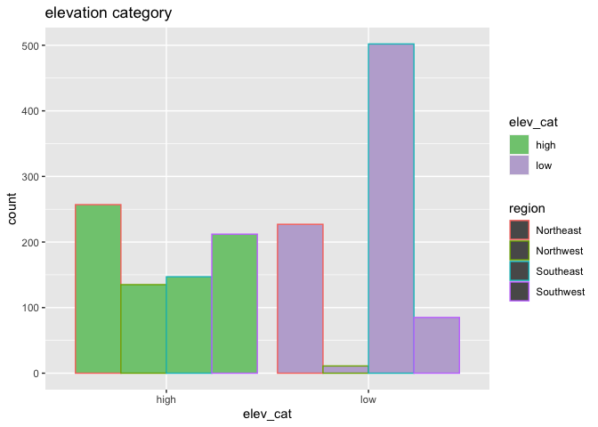

lab4
================
Mingxi Xu
9/17/2021

### Read in the data

``` r
if (!file.exists("met_all.gz"))
  download.file(
    url = "https://raw.githubusercontent.com/USCbiostats/data-science-data/master/02_met/met_all.gz",
    destfile = "met_all.gz",
    method   = "libcurl",
    timeout  = 60
    )
met <- data.table::fread("met_all.gz")
```

### Prepare for the data

``` r
met <- met[temp >= -17]
met[met$elev==9999.0] <- NA
met$ymd <- as.Date(paste(met$year, met$month, met$day, sep = "-"))
met[, table(week(ymd))]
```

    ## 
    ##     31     32     33     34     35 
    ## 297235 521565 527882 523806 446542

``` r
met <- met[week(ymd) == 31]
met_avg <- met[,.(
  temp     = mean(temp,na.rm=TRUE),
  rh       = mean(rh,na.rm=TRUE),
  wind.sp  = mean(wind.sp,na.rm=TRUE),
  vis.dist = mean(vis.dist,na.rm=TRUE),
  dew.point = mean(dew.point,na.rm=TRUE),
  lat      = mean(lat),
  lon      = mean(lon), 
  elev     = mean(elev,na.rm=TRUE)
), by="USAFID"]

met_avg[lat >= 39.71 & lon <= -98, region := "Northwest"]
met_avg[lat < 39.71 & lon <= -98, region := "Southwest"]
met_avg[lat >= 39.71 & lon > -98, region := "Northeast"]
met_avg[lat < 39.71 & lon > -98, region := "Southeast"]

met_avg[, table(region, useNA = "always")]
```

    ## region
    ## Northeast Northwest Southeast Southwest      <NA> 
    ##       484       146       649       297         0

``` r
met_avg[, elev_cat := fifelse(elev > 252, "high", "low")]
```

### Use geom\_violin to examine the wind speed and dew point temperature by region

``` r
ggplot(met_avg, mapping = aes(y = wind.sp, x = 1)) +
  geom_violin() +
  facet_grid(~region)
```

    ## Warning: Removed 15 rows containing non-finite values (stat_ydensity).

<!-- -->
 \#\#\# Use
geom\_jitter with stat\_smooth to examine the association between dew
point temperature and wind speed by region

``` r
met_avg[!is.na(region)] %>%
  ggplot(mapping = aes(x = dew.point, y = wind.sp, color = region, linetype = region)) +
  geom_jitter() + 
  geom_smooth(method = lm, se = FALSE, col = "black")
```

    ## `geom_smooth()` using formula 'y ~ x'

    ## Warning: Removed 16 rows containing non-finite values (stat_smooth).

    ## Warning: Removed 16 rows containing missing values (geom_point).

<!-- -->
 \#\#\# Use geom\_bar
to create barplots of the weather stations by elevation category
coloured by region

``` r
met_avg[!is.na(elev_cat)] %>%   
  ggplot() + 
  geom_bar(mapping = aes(x = elev_cat, colour = region, fill=elev_cat), position = "dodge") +         scale_fill_brewer(palette = "Accent") + labs(title = "elevation category ")
```

<!-- -->
 \#\#\# Use
stat\_summary to examine mean dew point and wind speed by region with
standard deviation error bars

``` r
ggplot(
  met_avg[!is.na(wind.sp) & !is.na(dew.point)],
  mapping = aes(x = region, y = wind.sp)) +
  stat_summary(fun.data = "mean_sdl") +
  stat_summary(fun.data = "mean_sdl", geom = "errorbar")
```

<!-- -->
 \#\#\# Make a map
showing the spatial trend in relative h in the US

``` r
temp.pal <- colorNumeric(c('darkgreen','goldenrod','brown'), domain = met_avg$rh)
leaflet(met_avg) %>%
  addCircles(
    lat = ~lat, lng = ~lon,
    
    label = ~paste0(round(rh,2), 'rh'), color = ~temp.pal(rh),
    opacity = 1, fillOpacity = 1,radius = 500
  ) %>%
  addLegend('bottomleft', pal = temp.pal, values = met_avg$rh,
            title = 'Temperature, c', opacity = 1)
```

<!-- -->
 \#\#\# Use a ggplot
extension

``` r
library(ggbeeswarm)
ggplot(met_avg,aes(elev_cat, wind.sp)) + geom_quasirandom()
```

    ## Warning: Removed 15 rows containing missing values (position_quasirandom).

<!-- -->

