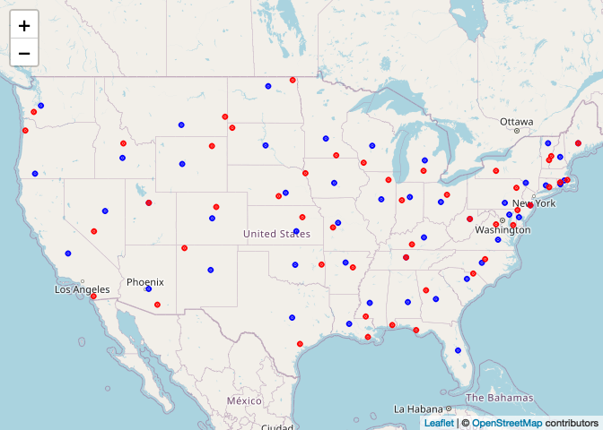

## Setup in R

1. Load the `data.table` (and the `dtplyr` and `dplyr` packages if you plan to work with those).

```{r}
library(data.table)
library(dtplyr)
library(dplyr)
library(tidyverse)
```

2. Load the met data from https://raw.githubusercontent.com/USCbiostats/data-science-data/master/02_met/met_all.gz, and also the station data. For the later, you can use the code we used during lecture to pre-process the stations data:

```{r}
if (!file.exists("met_all.gz"))
  download.file(
    url = "https://raw.githubusercontent.com/USCbiostats/data-science-data/master/02_met/met_all.gz",
    destfile = "met_all.gz",
    method   = "libcurl",
    timeout  = 60
    )
met_all <- data.table::fread("met_all.gz")
# Download the data
stations <- data.table::fread("ftp://ftp.ncdc.noaa.gov/pub/data/noaa/isd-history.csv")
stations[, USAF := as.integer(USAF)]

# Dealing with NAs and 999999
stations[, USAF   := fifelse(USAF == 999999, NA_integer_, USAF)]
stations[, CTRY   := fifelse(CTRY == "", NA_character_, CTRY)]
stations[, STATE  := fifelse(STATE == "", NA_character_, STATE)]

# Selecting the three relevant columns, and keeping unique records
stations <- unique(stations[, list(USAF, CTRY, STATE)])

# Dropping NAs
stations <- stations[!is.na(USAF)]

# Removing duplicates
stations[, n := 1:.N, by = .(USAF)]
stations <- stations[n == 1,][, n := NULL]
```

3. Merge the data as we did during the lecture.

```{r}
met <- merge(
  x = met_all, y = stations,
  by.x = "USAFID", by.y = "USAF",
  all.x = TRUE, all.y = FALSE
  )

# Print out a sample of the data
met[1:5, .(USAFID, WBAN, STATE)]
```


## Question 1: Representative station for the US

What is the median station in terms of temperature, wind speed, and atmospheric pressure? Look for the three weather stations that best represent continental US using the `quantile()` function. Do these three coincide?

```{r}
# obtaining averages per station
met_stations <- met[, .(
    wind.sp   = mean(wind.sp, na.rm = TRUE),
    atm.press = mean(atm.press, na.rm = TRUE),
    temp      = mean(temp, na.rm = TRUE)
  ), by = .(USAFID, STATE)]

# Computing the median
met_stations[, temp50   := quantile(temp, probs = .5, na.rm = TRUE)]
met_stations[, atmp50   := quantile(atm.press, probs = .5, na.rm = TRUE)]
met_stations[, windsp50 := quantile(wind.sp, probs = .5, na.rm = TRUE)]

# Filtering the data
# median station in terms of temperature
met_stations[which.min(abs(temp - temp50))]

# median station in terms of atmospheric pressure
met_stations[which.min(abs(atm.press - atmp50))]

# median station in terms of wind speed
met_stations[which.min(abs(wind.sp - windsp50))]

```
NO,the three weather stations do not coincide.

Knit the document, commit your changes, and Save it on GitHub. Don't forget to add `README.md` to the tree, the first time you render it.

## Question 2: Representative station per state

Just like the previous question, you are asked to identify what is the most representative, the median, station per state. This time, instead of looking at one variable at a time, look at the euclidean distance. If multiple stations show in the median, select the one located at the lowest latitude.

```{r}
# Computing the median
met_stations[, temp50s   := quantile(temp, probs = .5, na.rm = TRUE), by = STATE]
met_stations[, atmp50s   := quantile(atm.press, probs = .5, na.rm = TRUE), by = STATE]
met_stations[, windsp50s := quantile(wind.sp, probs = .5, na.rm = TRUE), by = STATE]

# Temperature
met_stations[, tempdif  := which.min(abs(temp - temp50s)), by=STATE]
met_stations[, recordid := 1:.N, by = STATE]
met_temp <- met_stations[recordid == tempdif, .(USAFID, temp, temp50s, STATE)]
met_temp #representative for temperature
# ATM press
met_stations[, tempdif  := which.min(abs(atm.press - atmp50s)), by=STATE]
met_stations[recordid == tempdif, .(USAFID, atm.press, atmp50s, STATE)]

# Wind speed
met_stations[, tempdif  := which.min(abs(wind.sp - windsp50s)), by=STATE]
met_stations[recordid == tempdif, .(USAFID, wind.sp, windsp50s, STATE)]
```
There are no multiple stations shown in the median 

Knit the doc and save it on GitHub.

## Question 3: In the middle?

For each state, identify what is the station that is closest to the mid-point of the state. Combining these with the stations you identified in the previous question, use `leaflet()` to visualize all ~100 points in the same figure, applying different colors for those identified in this question.

```{r}
met_stations <- unique(met[, .(USAFID, STATE, lon, lat)])

met_stations[, n := 1:.N, by = USAFID]
met_stations <- met_stations[n == 1]
# This is a short cut using the .SD keyword
# met_stations[, .SD[1], by = USAFID] 

met_stations[, lat_mid := quantile(lat, probs = .5, na.rm = TRUE), by = STATE]
met_stations[, lon_mid := quantile(lon, probs = .5, na.rm = TRUE), by = STATE]

# Looking at the euclidean distances
met_stations[,  distance := sqrt((lat - lat_mid)^2 + (lon - lon_mid)^2)]
met_stations[, minrecord := which.min(distance), by = STATE]
met_stations[, n := 1:.N, by = STATE]
met_location <- met_stations[n == minrecord, .(USAFID, STATE, lon, lat)]
met_location

all_stations <- met[, .(USAFID, lat, lon, STATE)][, .SD[1], by = "USAFID"]

# Recovering lon and lat from the original dataset
met_temp <- merge(
  x = met_temp,
  y = all_stations,
  by = "USAFID",
  all.x = TRUE, all.y = FALSE
)
library(leaflet)

# Combining datasets
dat1 <- met_location[, .(lon, lat)]
dat1[, type := "Center of the state"]

# Combining datasets
dat2 <- met_temp[, .(lon, lat)]
dat2[, type := "Center of the temperature"]

dat <- rbind(dat1, dat2)

# Copy paste from previous lab
rh_pal <- colorFactor(c('blue', 'red'),
                       domain = as.factor(dat$type))
leaflet(dat) %>%
  addProviderTiles("OpenStreetMap") %>%
  addCircles(lng = ~lon, lat = ~lat, color=~rh_pal(type), opacity=1,fillOpacity=1, radius=500)

```

Knit the doc and save it on GitHub.

## Question 4: Means of means

Using the `quantile()` function, generate a summary table that shows the number of states included, average temperature, wind-speed, and atmospheric pressure by the variable "average temperature level," which you'll need to create. 

Start by computing the states' average temperature. Use that measurement to classify them according to the following criteria: 

- low: temp < 20
- Mid: temp >= 20 and temp < 25
- High: temp >= 25

```{r}
met[,state_temp := mean(temp, na.rm = T), by= STATE]
met[,temp_cat :=fifelse(
  state_temp < 20,"low temp",
  fifelse(state_temp < 25, "mid temp", "high temp")
)]
```

Once you are done with that, you can compute the following:

- Number of entries (records),
- Number of NA entries,
- Number of stations,
- Number of states included, and
- Mean temperature, wind-speed, and atmospheric pressure.

All by the levels described before.

```{r}
table(met$temp_cat,useNA = "always")
```

```{r}
tab <- met[,.(
  N_entries = .N,
  N_stations = unique(USAFID))
  by = temp_cat
]
knitr::kable(tab)
```

Knit the document, commit your changes, and push them to GitHub. If you'd like, you can take this time to include the link of [the issue of the week](https://github.com/USCbiostats/PM566/issues/23) so that you let us know when you are done, e.g.,

```bash
git commit -a -m "Finalizing lab 5 https://github.com/USCbiostats/PM566/issues/23"
```


