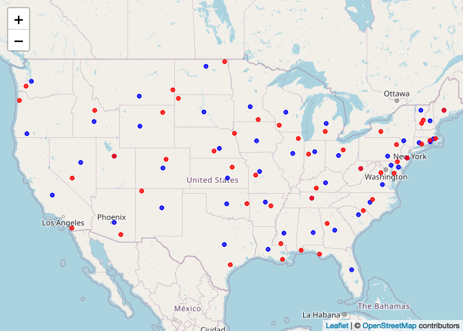

Lab5
================
Mingxi Xu

## Setup in R

1.  Load the `data.table` (and the `dtplyr` and `dplyr` packages if you
    plan to work with those).

``` r
library(data.table)
library(dtplyr)
library(dplyr)
```

    ## 
    ## 载入程辑包：'dplyr'

    ## The following objects are masked from 'package:data.table':
    ## 
    ##     between, first, last

    ## The following objects are masked from 'package:stats':
    ## 
    ##     filter, lag

    ## The following objects are masked from 'package:base':
    ## 
    ##     intersect, setdiff, setequal, union

2.  Load the met data from
    <https://raw.githubusercontent.com/USCbiostats/data-science-data/master/02_met/met_all.gz>,
    and also the station data. For the later, you can use the code we
    used during lecture to pre-process the stations data:

``` r
if (!file.exists("met_all.gz"))
  download.file(
    url = "https://raw.githubusercontent.com/USCbiostats/data-science-data/master/02_met/met_all.gz",
    destfile = "met_all.gz",
    method   = "libcurl",
    timeout  = 60
    )
met_all <- data.table::fread("met_all.gz")
# Download the data
stations <- data.table::fread("ftp://ftp.ncdc.noaa.gov/pub/data/noaa/isd-history.csv")
stations[, USAF := as.integer(USAF)]
```

    ## Warning in eval(jsub, SDenv, parent.frame()): 强制改变过程中产生了NA

``` r
# Dealing with NAs and 999999
stations[, USAF   := fifelse(USAF == 999999, NA_integer_, USAF)]
stations[, CTRY   := fifelse(CTRY == "", NA_character_, CTRY)]
stations[, STATE  := fifelse(STATE == "", NA_character_, STATE)]

# Selecting the three relevant columns, and keeping unique records
stations <- unique(stations[, list(USAF, CTRY, STATE)])

# Dropping NAs
stations <- stations[!is.na(USAF)]

# Removing duplicates
stations[, n := 1:.N, by = .(USAF)]
stations <- stations[n == 1,][, n := NULL]
```

3.  Merge the data as we did during the lecture.

``` r
met <- merge(
  x = met_all, y = stations,
  by.x = "USAFID", by.y = "USAF",
  all.x = TRUE, all.y = FALSE
  )

# Print out a sample of the data
met[1:5, .(USAFID, WBAN, STATE)]
```

    ##    USAFID  WBAN STATE
    ## 1: 690150 93121    CA
    ## 2: 690150 93121    CA
    ## 3: 690150 93121    CA
    ## 4: 690150 93121    CA
    ## 5: 690150 93121    CA

## Question 1: Representative station for the US

What is the median station in terms of temperature, wind speed, and
atmospheric pressure? Look for the three weather stations that best
represent continental US using the `quantile()` function. Do these three
coincide?

``` r
# obtaining averages per station
met_stations <- met[, .(
    wind.sp   = mean(wind.sp, na.rm = TRUE),
    atm.press = mean(atm.press, na.rm = TRUE),
    temp      = mean(temp, na.rm = TRUE)
  ), by = .(USAFID, STATE)]

# Computing the median
met_stations[, temp50   := quantile(temp, probs = .5, na.rm = TRUE)]
met_stations[, atmp50   := quantile(atm.press, probs = .5, na.rm = TRUE)]
met_stations[, windsp50 := quantile(wind.sp, probs = .5, na.rm = TRUE)]

# Filtering the data
# median station in terms of temperature
met_stations[which.min(abs(temp - temp50))]
```

    ##    USAFID STATE  wind.sp atm.press     temp   temp50   atmp50 windsp50
    ## 1: 720458    KY 1.209682       NaN 23.68173 23.68406 1014.691 2.461838

``` r
# median station in terms of atmospheric pressure
met_stations[which.min(abs(atm.press - atmp50))]
```

    ##    USAFID STATE  wind.sp atm.press     temp   temp50   atmp50 windsp50
    ## 1: 722238    AL 1.472656  1014.691 26.13978 23.68406 1014.691 2.461838

``` r
# median station in terms of wind speed
met_stations[which.min(abs(wind.sp - windsp50))]
```

    ##    USAFID STATE  wind.sp atm.press     temp   temp50   atmp50 windsp50
    ## 1: 720929    WI 2.461838       NaN 17.43278 23.68406 1014.691 2.461838

NO,the three weather stations do not coincide.

Knit the document, commit your changes, and Save it on GitHub. Don’t
forget to add `README.md` to the tree, the first time you render it.

## Question 2: Representative station per state

Just like the previous question, you are asked to identify what is the
most representative, the median, station per state. This time, instead
of looking at one variable at a time, look at the euclidean distance. If
multiple stations show in the median, select the one located at the
lowest latitude.

``` r
# Computing the median
met_stations[, temp50s   := quantile(temp, probs = .5, na.rm = TRUE), by = STATE]
met_stations[, atmp50s   := quantile(atm.press, probs = .5, na.rm = TRUE), by = STATE]
met_stations[, windsp50s := quantile(wind.sp, probs = .5, na.rm = TRUE), by = STATE]

# Temperature
met_stations[, tempdif  := which.min(abs(temp - temp50s)), by=STATE]
met_stations[, recordid := 1:.N, by = STATE]
met_temp <- met_stations[recordid == tempdif, .(USAFID, temp, temp50s, STATE)]
met_temp #representative for temperature
```

    ##     USAFID     temp  temp50s STATE
    ##  1: 720202 17.16329 17.98061    OR
    ##  2: 720254 19.24684 19.24684    WA
    ##  3: 720284 20.51970 20.51970    MI
    ##  4: 720328 21.94820 21.94446    WV
    ##  5: 720545 22.44858 22.36880    CT
    ##  6: 720592 26.31534 26.33664    AL
    ##  7: 720605 25.87364 25.80545    SC
    ##  8: 720636 23.99322 23.95109    MO
    ##  9: 720855 18.45570 18.52849    ND
    ## 10: 720964 27.57697 27.57325    FL
    ## 11: 722041 27.84758 27.87430    LA
    ## 12: 722133 27.14427 27.14427    OK
    ## 13: 722142 20.32324 20.56798    ID
    ## 14: 722188 26.07275 26.24296    AR
    ## 15: 722197 26.70404 26.70404    GA
    ## 16: 722218 24.89883 24.89883    MD
    ## 17: 722322 23.98226 23.88844    KY
    ## 18: 722358 26.54093 26.69258    MS
    ## 19: 722550 29.74982 29.75188    TX
    ## 20: 722692 24.37799 24.37799    VA
    ## 21: 722745 30.31538 30.32372    AZ
    ## 22: 722931 22.66268 22.66268    CA
    ## 23: 723060 24.70791 24.72953    NC
    ## 24: 723273 25.01262 24.88657    TN
    ## 25: 723658 24.94447 24.94447    NM
    ## 26: 724090 23.47238 23.47238    NJ
    ## 27: 724180 24.56026 24.56026    DE
    ## 28: 724200 22.03309 22.02062    OH
    ## 29: 724386 22.32575 22.25059    IN
    ## 30: 724555 24.21648 24.21220    KS
    ## 31: 724699 21.94228 21.49638    CO
    ## 32: 724855 24.34157 24.56293    NV
    ## 33: 724988 20.44142 20.40674    NY
    ## 34: 725064 21.40933 21.30662    MA
    ## 35: 725070 22.53551 22.53551    RI
    ## 36: 725130 21.69177 21.69177    PA
    ## 37: 725305 22.36831 22.43194    IL
    ## 38: 725526 21.87354 21.87354    NE
    ## 39: 725570 21.36209 21.33461    IA
    ## 40: 725724 24.39332 24.35182    UT
    ## 41: 726073 18.82098 18.79016    ME
    ## 42: 726115 18.60548 18.61379    VT
    ## 43: 726116 19.23920 19.55054    NH
    ## 44: 726438 18.85524 18.85524    WI
    ## 45: 726589 19.58483 19.63017    MN
    ## 46: 726627 20.35662 20.35662    SD
    ## 47: 726650 19.75554 19.80699    WY
    ## 48: 726777 19.15492 19.15492    MT
    ##     USAFID     temp  temp50s STATE

``` r
# ATM press
met_stations[, tempdif  := which.min(abs(atm.press - atmp50s)), by=STATE]
met_stations[recordid == tempdif, .(USAFID, atm.press, atmp50s, STATE)]
```

    ##     USAFID atm.press  atmp50s STATE
    ##  1: 720254       NaN       NA    WA
    ##  2: 720855       NaN       NA    ND
    ##  3: 722029  1015.335 1015.335    FL
    ##  4: 722085  1015.298 1015.281    SC
    ##  5: 722093  1014.906 1014.927    MI
    ##  6: 722181  1015.208 1015.208    GA
    ##  7: 722269  1014.926 1014.959    AL
    ##  8: 722320  1014.593 1014.593    LA
    ##  9: 722340  1014.842 1014.836    MS
    ## 10: 722479  1012.464 1012.460    TX
    ## 11: 722745  1010.144 1010.144    AZ
    ## 12: 722899  1012.557 1012.557    CA
    ## 13: 723109  1015.420 1015.420    NC
    ## 14: 723300  1014.522 1014.522    MO
    ## 15: 723346  1015.144 1015.144    TN
    ## 16: 723436  1014.591 1014.591    AR
    ## 17: 723537  1012.567 1012.567    OK
    ## 18: 723600  1012.404 1012.525    NM
    ## 19: 724037  1015.158 1015.158    VA
    ## 20: 724040  1014.824 1014.824    MD
    ## 21: 724075  1014.825 1014.825    NJ
    ## 22: 724120  1015.757 1015.762    WV
    ## 23: 724180  1015.046 1015.046    DE
    ## 24: 724237  1015.236 1015.245    KY
    ## 25: 724286  1015.351 1015.351    OH
    ## 26: 724373  1015.063 1015.063    IN
    ## 27: 724586  1013.389 1013.389    KS
    ## 28: 724660  1013.334 1013.334    CO
    ## 29: 724860  1011.947 1012.204    NV
    ## 30: 725040  1014.810 1014.810    CT
    ## 31: 725053  1014.887 1014.887    NY
    ## 32: 725064  1014.721 1014.751    MA
    ## 33: 725070  1014.837 1014.728    RI
    ## 34: 725109  1015.474 1015.435    PA
    ## 35: 725440  1014.760 1014.760    IL
    ## 36: 725461  1014.957 1014.964    IA
    ## 37: 725555  1014.345 1014.332    NE
    ## 38: 725686  1013.157 1013.157    WY
    ## 39: 725755  1012.243 1011.972    UT
    ## 40: 725784  1012.908 1012.855    ID
    ## 41: 725895  1014.726 1015.269    OR
    ## 42: 726114  1014.792 1014.792    VT
    ## 43: 726155  1014.689 1014.689    NH
    ## 44: 726196  1014.323 1014.399    ME
    ## 45: 726425  1014.893 1014.893    WI
    ## 46: 726545  1014.497 1014.398    SD
    ## 47: 726559  1015.042 1015.042    MN
    ## 48: 726777  1014.299 1014.185    MT
    ##     USAFID atm.press  atmp50s STATE

``` r
# Wind speed
met_stations[, tempdif  := which.min(abs(wind.sp - windsp50s)), by=STATE]
met_stations[recordid == tempdif, .(USAFID, wind.sp, windsp50s, STATE)]
```

    ##     USAFID  wind.sp windsp50s STATE
    ##  1: 720254 1.268571  1.268571    WA
    ##  2: 720328 1.617823  1.633487    WV
    ##  3: 720386 2.617071  2.617071    MN
    ##  4: 720422 3.679474  3.680613    KS
    ##  5: 720492 1.408247  1.408247    VT
    ##  6: 720532 3.098777  3.098777    CO
    ##  7: 720602 1.616549  1.696119    SC
    ##  8: 720858 3.972789  3.956459    ND
    ##  9: 720951 1.493666  1.495596    GA
    ## 10: 720971 3.873392  3.873392    WY
    ## 11: 721031 1.513550  1.576035    TN
    ## 12: 722029 2.699017  2.705069    FL
    ## 13: 722076 2.244115  2.237622    IL
    ## 14: 722165 1.599550  1.636392    MS
    ## 15: 722202 3.404683  3.413737    TX
    ## 16: 722218 1.883499  1.883499    MD
    ## 17: 722275 1.662132  1.662132    AL
    ## 18: 722486 1.592840  1.592840    LA
    ## 19: 722676 3.776083  3.776083    NM
    ## 20: 722740 3.125322  3.074359    AZ
    ## 21: 722899 2.561738  2.565445    CA
    ## 22: 723010 1.641749  1.627306    NC
    ## 23: 723415 1.875302  1.938625    AR
    ## 24: 723545 3.852697  3.852697    OK
    ## 25: 723860 2.968539  3.035050    NV
    ## 26: 724006 1.650539  1.653032    VA
    ## 27: 724090 2.148606  2.148606    NJ
    ## 28: 724180 2.752929  2.752929    DE
    ## 29: 724303 2.606462  2.554397    OH
    ## 30: 724350 1.930836  1.895486    KY
    ## 31: 724373 2.347673  2.344333    IN
    ## 32: 724458 2.459746  2.453547    MO
    ## 33: 724700 3.180628  3.145427    UT
    ## 34: 725016 2.376050  2.304075    NY
    ## 35: 725079 2.583469  2.583469    RI
    ## 36: 725087 2.126514  2.101801    CT
    ## 37: 725088 2.773018  2.710944    MA
    ## 38: 725103 1.784167  1.784167    PA
    ## 39: 725464 2.679227  2.680875    IA
    ## 40: 725624 3.192539  3.192539    NE
    ## 41: 725867 2.702517  2.568944    ID
    ## 42: 725975 2.080792  2.011436    OR
    ## 43: 726056 1.556907  1.563826    NH
    ## 44: 726077 2.337241  2.237210    ME
    ## 45: 726284 2.273423  2.273423    MI
    ## 46: 726504 2.053283  2.053283    WI
    ## 47: 726519 3.665638  3.665638    SD
    ## 48: 726770 4.151737  4.151737    MT
    ##     USAFID  wind.sp windsp50s STATE

There are no multiple stations shown in the median

Knit the doc and save it on GitHub.

## Question 3: In the middle?

For each state, identify what is the station that is closest to the
mid-point of the state. Combining these with the stations you identified
in the previous question, use `leaflet()` to visualize all \~100 points
in the same figure, applying different colors for those identified in
this question.

``` r
met_stations <- unique(met[, .(USAFID, STATE, lon, lat)])

met_stations[, n := 1:.N, by = USAFID]
met_stations <- met_stations[n == 1]
# This is a short cut using the .SD keyword
# met_stations[, .SD[1], by = USAFID] 

met_stations[, lat_mid := quantile(lat, probs = .5, na.rm = TRUE), by = STATE]
met_stations[, lon_mid := quantile(lon, probs = .5, na.rm = TRUE), by = STATE]

# Looking at the euclidean distances
met_stations[,  distance := sqrt((lat - lat_mid)^2 + (lon - lon_mid)^2)]
met_stations[, minrecord := which.min(distance), by = STATE]
met_stations[, n := 1:.N, by = STATE]
met_location <- met_stations[n == minrecord, .(USAFID, STATE, lon, lat)]
met_location
```

    ##     USAFID STATE      lon    lat
    ##  1: 720328    WV  -80.274 39.000
    ##  2: 720388    WA -122.287 47.104
    ##  3: 720401    AR  -92.450 35.600
    ##  4: 720448    KY  -84.770 37.578
    ##  5: 720468    LA  -92.099 30.558
    ##  6: 720498    VA  -77.517 37.400
    ##  7: 720603    SC  -80.567 34.283
    ##  8: 720867    ND -100.024 48.390
    ##  9: 720928    OH  -83.115 40.280
    ## 10: 722011    FL  -81.437 28.290
    ## 11: 722175    GA  -83.600 32.633
    ## 12: 722201    NC  -79.101 35.582
    ## 13: 722265    AL  -86.350 32.383
    ## 14: 722350    MS  -90.083 32.317
    ## 15: 722575    TX  -97.683 31.083
    ## 16: 722677    NM -105.662 35.003
    ## 17: 722783    AZ -111.733 33.467
    ## 18: 723273    TN  -86.520 36.009
    ## 19: 723540    OK  -97.383 35.417
    ## 20: 723898    CA -119.628 36.319
    ## 21: 724067    MD  -76.414 39.326
    ## 22: 724088    DE  -75.467 39.133
    ## 23: 724090    NJ  -74.350 40.033
    ## 24: 724397    IL  -88.950 40.483
    ## 25: 724453    MO  -93.183 38.704
    ## 26: 724509    KS  -97.275 38.058
    ## 27: 724770    NV -116.005 39.601
    ## 28: 725027    CT  -72.828 41.510
    ## 29: 725068    MA  -71.021 41.876
    ## 30: 725074    RI  -71.412 41.597
    ## 31: 725118    PA  -76.851 40.217
    ## 32: 725145    NY  -74.795 41.702
    ## 33: 725335    IN  -86.152 40.648
    ## 34: 725405    MI  -84.688 43.322
    ## 35: 725466    IA  -93.566 41.691
    ## 36: 725520    NE  -98.317 40.967
    ## 37: 725724    UT -111.723 40.219
    ## 38: 725865    ID -114.300 43.500
    ## 39: 725970    OR -122.867 42.367
    ## 40: 726073    ME  -69.667 44.533
    ## 41: 726114    VT  -72.614 44.534
    ## 42: 726155    NH  -71.433 43.567
    ## 43: 726396    CO -105.516 39.050
    ## 44: 726452    WI  -89.837 44.359
    ## 45: 726560    SD -100.285 44.381
    ## 46: 726569    MN  -94.382 44.859
    ## 47: 726720    WY -108.450 43.067
    ## 48: 726770    MT -108.533 45.800
    ##     USAFID STATE      lon    lat

``` r
all_stations <- met[, .(USAFID, lat, lon, STATE)][, .SD[1], by = "USAFID"]

# Recovering lon and lat from the original dataset
met_temp <- merge(
  x = met_temp,
  y = all_stations,
  by = "USAFID",
  all.x = TRUE, all.y = FALSE
)
library(leaflet)

# Combining datasets
dat1 <- met_location[, .(lon, lat)]
dat1[, type := "Center of the state"]

# Combining datasets
dat2 <- met_temp[, .(lon, lat)]
dat2[, type := "Center of the temperature"]

dat <- rbind(dat1, dat2)

# Copy paste from previous lab
rh_pal <- colorFactor(c('blue', 'red'),
                       domain = as.factor(dat$type))
leaflet(dat) %>%
  addProviderTiles("OpenStreetMap") %>%
  addCircles(lng = ~lon, lat = ~lat, color=~rh_pal(type), opacity=1,fillOpacity=1, radius=500)
```

<!-- -->
 Knit the doc and save
it on GitHub.

## Question 4: Means of means

Using the `quantile()` function, generate a summary table that shows the
number of states included, average temperature, wind-speed, and
atmospheric pressure by the variable “average temperature level,” which
you’ll need to create.

Start by computing the states’ average temperature. Use that measurement
to classify them according to the following criteria:

-   low: temp &lt; 20
-   Mid: temp &gt;= 20 and temp &lt; 25
-   High: temp &gt;= 25

Once you are done with that, you can compute the following:

-   Number of entries (records),
-   Number of NA entries,
-   Number of stations,
-   Number of states included, and
-   Mean temperature, wind-speed, and atmospheric pressure.

All by the levels described before.

Knit the document, commit your changes, and push them to GitHub. If
you’d like, you can take this time to include the link of [the issue of
the week](https://github.com/USCbiostats/PM566/issues/23) so that you
let us know when you are done, e.g.,

``` bash
git commit -a -m "Finalizing lab 5 https://github.com/USCbiostats/PM566/issues/23"
```
