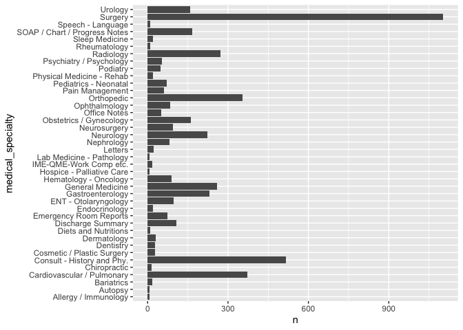
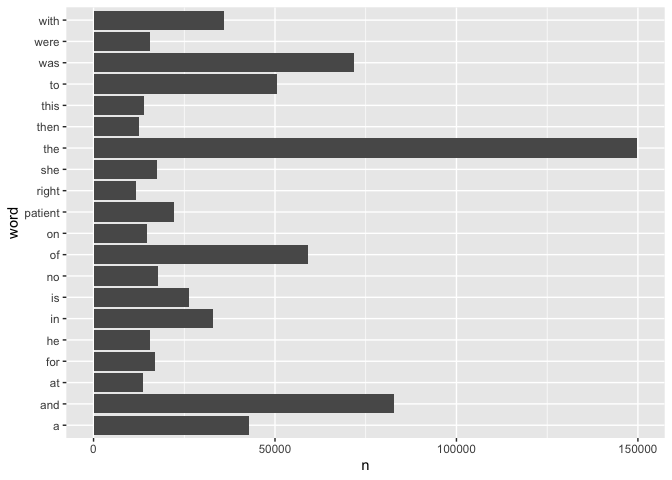
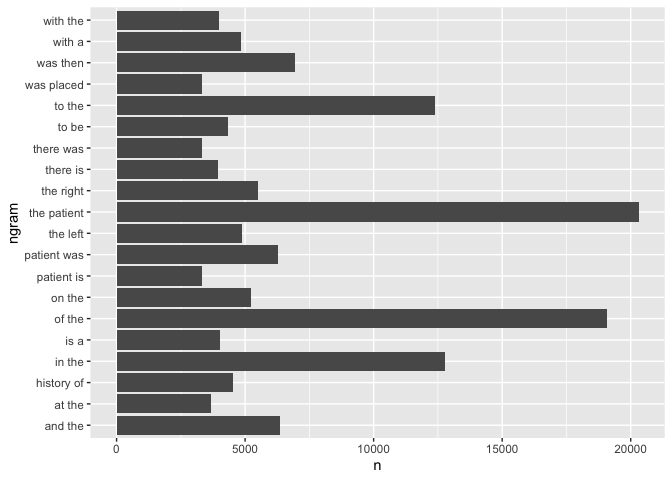
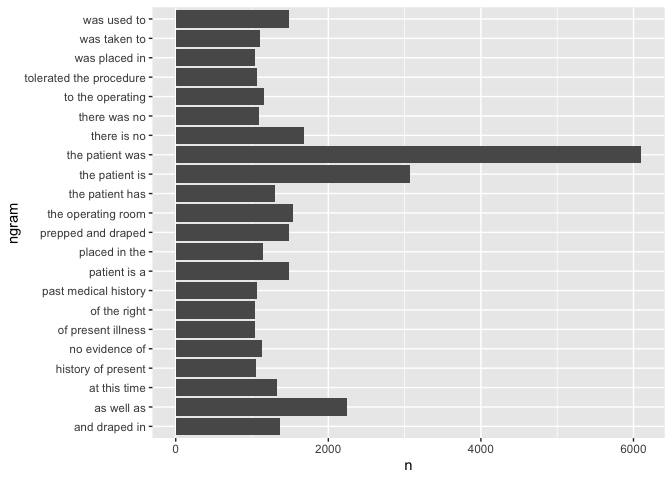
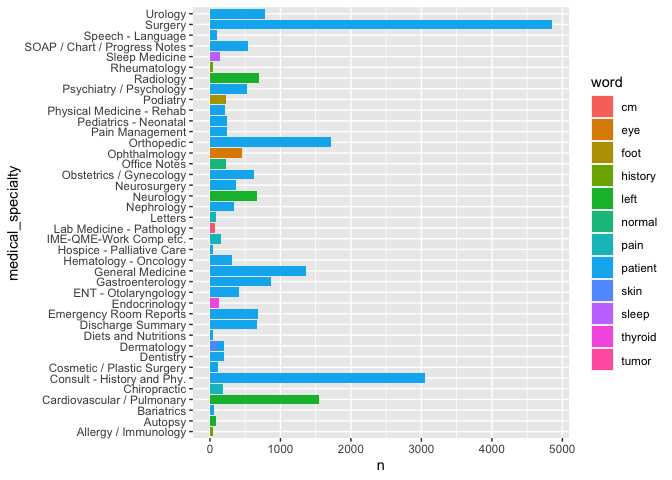
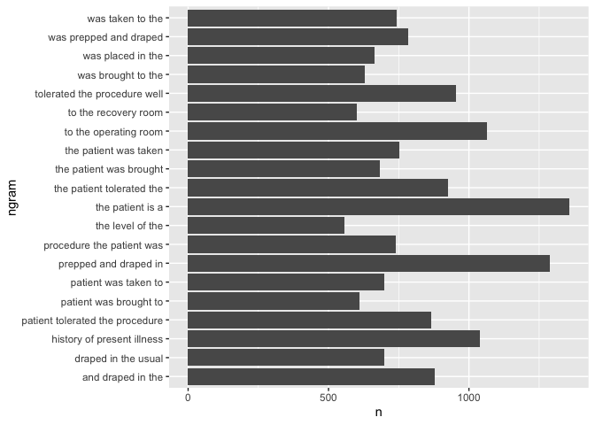

Lab6
================
Mingxi Xu

``` r
knitr::opts_chunk$set()
```

# Learning goals

-   Use `unnest_tokens()` and `unnest_ngrams()` to extract tokens and
    ngrams from text.
-   Use dplyr and ggplot2 to analyze text data

# Lab description

For this lab we will be working with a new dataset. The dataset contains
transcription samples from <https://www.mtsamples.com/>. And is loaded
and “fairly” cleaned at
<https://raw.githubusercontent.com/USCbiostats/data-science-data/master/00_mtsamples/mtsamples.csv>.

This markdown document should be rendered using `github_document`
document.

# Setup the Git project and the GitHub repository

1.  Go to your documents (or wherever you are planning to store the
    data) in your computer, and create a folder for this project, for
    example, “PM566-labs”

2.  In that folder, save [this
    template](https://raw.githubusercontent.com/USCbiostats/PM566/master/content/assignment/06-lab.Rmd)
    as “README.Rmd”. This will be the markdown file where all the magic
    will happen.

3.  Go to your GitHub account and create a new repository, hopefully of
    the same name that this folder has, i.e., “PM566-labs”.

4.  Initialize the Git project, add the “README.Rmd” file, and make your
    first commit.

5.  Add the repo you just created on GitHub.com to the list of remotes,
    and push your commit to origin while setting the upstream.

### Setup packages

You should load in `dplyr`, (or `data.table` if you want to work that
way), `ggplot2` and `tidytext`. If you don’t already have `tidytext`
then you can install with

### read in Medical Transcriptions

Loading in reference transcription samples from
<https://www.mtsamples.com/>

``` r
library(readr)
library(dplyr)
library(tidyverse)
library(ggplot2)
mt_samples <- read_csv("mtsamples.csv")
mt_samples <- mt_samples %>%
  select(description, medical_specialty, transcription)
```

------------------------------------------------------------------------

## Question 1: What specialties do we have?

We can use `count()` from `dplyr` to figure out how many different
catagories do we have? Are these catagories related? overlapping? evenly
distributed?

``` r
mt_samples %>%
  count(medical_specialty,sort = TRUE) %>%
  ggplot(aes(medical_specialty,n))+geom_col()+coord_flip()
```

<!-- -->

We have 40 categories in total. The categories may be related or
overlapping since each observation may be involved in different
specialities. For example, Urology may involves some patient cases which
may need Surgery.

## Question 2

-   Tokenize the the words in the `transcription` column
-   Count the number of times each token appears
-   Visualize the top 20 most frequent words

Explain what we see from this result. Does it makes sense? What insights
(if any) do we get?

``` r
library(tidytext)
library(ggplot2)

mt_samples %>%
   unnest_tokens(word, transcription) %>%
   count(word, sort = TRUE) %>%
   top_n(20, n) %>%
   ggplot(aes(word,n)) + geom_col() +coord_flip()
```

<!-- -->

The top 20 frequent words enrich in those words which may provide less
semantic meanings such as the, is, of. These words are called stop
words. However, we can still see a reasonable word “patient” since these
are medical transcription samples.

## Question 3

-   Redo visualization but remove stopwords before
-   Bonus points if you remove numbers as well

What do we see know that we have removed stop words? Does it give us a
better idea of what the text is about?

``` r
mt_samples %>%
   unnest_tokens(word, transcription) %>%
   anti_join(stop_words, by = "word") %>%
   subset(!grepl('^\\d+$', word)) %>%
   count(word, sort = TRUE) %>%
   top_n(20, n) %>%
   ggplot(aes(word,n)) + geom_col() + coord_flip()
```

<!-- -->

The top 20 frequent words look more informative when we removed the stop
words and numbers. These words are clear symbols of medical
transcriptions which involve organs, symptoms and so on.

# Question 4

repeat question 2, but this time tokenize into bi-grams. how does the
result change if you look at tri-grams?

``` r
mt_samples %>%
   unnest_ngrams(ngram, transcription, n = 2) %>%
   count(ngram, sort = TRUE) %>%
   top_n(20, n) %>%
   ggplot(aes(ngram,n)) + geom_col() + coord_flip()
```

<!-- -->

``` r
mt_samples %>%
   unnest_ngrams(ngram, transcription, n = 3) %>%
   count(ngram, sort = TRUE) %>%
   top_n(20, n) %>%
   ggplot(aes(ngram,n)) + geom_col() + coord_flip()
```

<!-- -->

The results return similar to what we see in question 2: bi-grams
comprised of stop words occupy the most parts. If we try tri-grams, the
results may include some meaningful words like illness, medical,
history.

# Question 5

Using the results you got from questions 4. Pick a word and count the
words that appears after and before it.

``` r
mt_samples %>%
   unnest_ngrams(ngram, transcription, n = 2) %>%
   separate(ngram, into = c("word1", "word2"), sep = " ") %>%
   select(word1, word2) %>%
   filter(word1 == "patient") %>%
   count(word2, sort = TRUE)
```

    ## # A tibble: 588 × 2
    ##    word2         n
    ##    <chr>     <int>
    ##  1 was        6293
    ##  2 is         3332
    ##  3 has        1417
    ##  4 tolerated   994
    ##  5 had         888
    ##  6 will        616
    ##  7 denies      552
    ##  8 and         377
    ##  9 states      363
    ## 10 does        334
    ## # … with 578 more rows

``` r
mt_samples %>%
   unnest_ngrams(ngram, transcription, n = 2) %>%
   separate(ngram, into = c("word1", "word2"), sep = " ") %>%
   select(word1, word2) %>%
   filter(word2 == "patient") %>%
   count(word1, sort = TRUE)
```

    ## # A tibble: 269 × 2
    ##    word1         n
    ##    <chr>     <int>
    ##  1 the       20307
    ##  2 this        470
    ##  3 history     101
    ##  4 a            67
    ##  5 and          47
    ##  6 procedure    32
    ##  7 female       26
    ##  8 with         25
    ##  9 use          24
    ## 10 old          23
    ## # … with 259 more rows

The first table shows the words appearing after the word “patient”. The
second table shows the words appearing before the word “patient”.

# Question 6

Which words are most used in each of the specialties. you can use
`group_by()` and `top_n()` from `dplyr` to have the calculations be done
within each specialty. Remember to remove stopwords. How about the most
5 used words?

``` r
mt_samples %>%
   unnest_tokens(word, transcription) %>%
   anti_join(stop_words, by = "word") %>%
   subset(!grepl('^\\d+$', word)) %>%
   group_by(medical_specialty) %>%
   count(word,sort=TRUE) %>%
   top_n(1,n)
```

    ## # A tibble: 42 × 3
    ## # Groups:   medical_specialty [40]
    ##    medical_specialty          word        n
    ##    <chr>                      <chr>   <int>
    ##  1 Surgery                    patient  4855
    ##  2 Consult - History and Phy. patient  3046
    ##  3 Orthopedic                 patient  1711
    ##  4 Cardiovascular / Pulmonary left     1550
    ##  5 General Medicine           patient  1356
    ##  6 Gastroenterology           patient   872
    ##  7 Urology                    patient   776
    ##  8 Radiology                  left      701
    ##  9 Emergency Room Reports     patient   685
    ## 10 Discharge Summary          patient   672
    ## # … with 32 more rows

``` r
mt_samples %>%
   unnest_tokens(word, transcription) %>%
   anti_join(stop_words, by = "word") %>%
   subset(!grepl('^\\d+$', word)) %>%
   group_by(medical_specialty) %>%
   count(word,sort=TRUE) %>%
   top_n(5,n) %>%
   arrange(desc(medical_specialty))
```

    ## # A tibble: 210 × 3
    ## # Groups:   medical_specialty [40]
    ##    medical_specialty word           n
    ##    <chr>             <chr>      <int>
    ##  1 Urology           patient      776
    ##  2 Urology           bladder      357
    ##  3 Urology           procedure    306
    ##  4 Urology           left         288
    ##  5 Urology           history      196
    ##  6 Surgery           patient     4855
    ##  7 Surgery           left        3263
    ##  8 Surgery           procedure   3243
    ##  9 Surgery           anesthesia  1687
    ## 10 Surgery           incision    1641
    ## # … with 200 more rows

The first table shows the most used words in each of the specialities.
The second table shows the most 5 used words in each of the
specialities.

# Question 7 - extra

Find your own insight in the data:

Ideas:

-   Interesting ngrams
-   See if certain words are used more in some specialties then others

``` r
mt_samples %>%
   unnest_tokens(word, transcription) %>%
   anti_join(stop_words, by = "word") %>%
   subset(!grepl('^\\d+$', word)) %>%
   group_by(medical_specialty) %>%
   count(word,sort=TRUE) %>%
   top_n(1,n) %>%
   ggplot(aes(medical_specialty, n, fill=word)) +geom_col()+ coord_flip()
```

<!-- -->

Based on the above graph, we can see “patient” is absolutely the most
frequent word in most of the medical specialties. However, “eye” is more
frequently used in Ophthalmology since Ophthalmology is right focusing
on eye-related diseases.

``` r
mt_samples %>%
   unnest_ngrams(ngram, transcription, n = 4) %>%
   count(ngram, sort = TRUE) %>%
   top_n(20, n) %>%
   ggplot(aes(ngram,n)) + geom_col() + coord_flip()
```

<!-- -->

From the quadra-gram results, we can infer that many sentences are
recorded using passive voice such as “was taken to”, “was placed in”,
“was brought to” and so on. I guess this might be a medical
transcription style.
